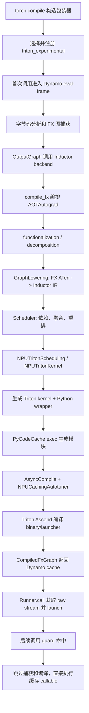
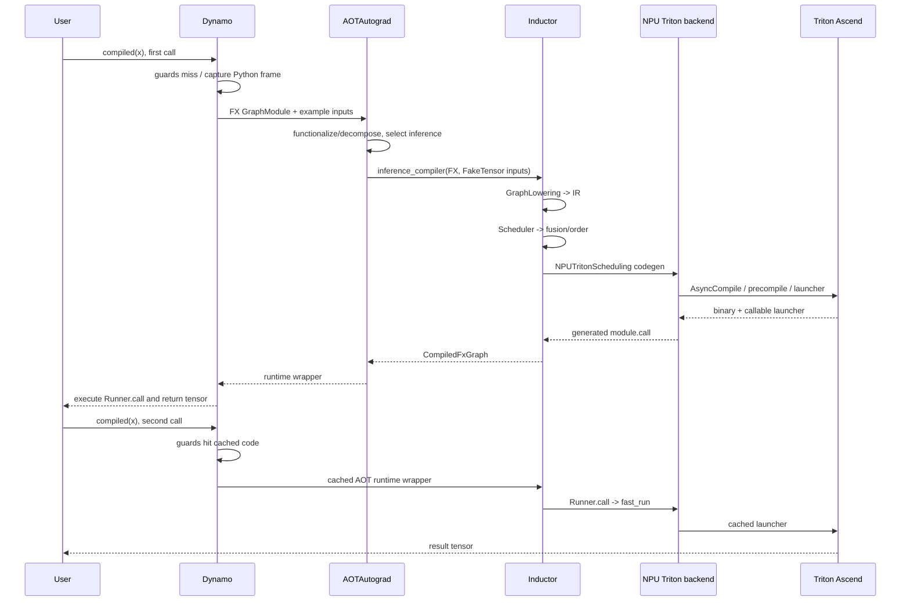

# PyTorch Feature 设计与实现分析

> 目标：理解 `torch.compile(..., backend="inductor")` 在 NPU
> `triton_experimental` 后端上的首次编译、代码生成和缓存执行路径。
>
> 分析版本：PyTorch `2.14.0a0+git8e86e0a`（源码提交
> `8e86e0a23e3679c2bf3406cf0837fcb6297a5d9b`），torch_npu
> `2.14.0a0+git83cc452`（源码提交
> `83cc452480c3546fd5cccf853bfe3a360ce9dbfc`）。动态验证日期为
> 2026-09-04，设备为 Ascend 910B2。

## 模块设计目标与背景

Inductor 在这条链中的职责不是捕获任意 Python，而是接收已经规范化的
FX/ATen 图，把它降低成 Inductor IR，进行依赖分析、融合和调度，再调用设备后端生成
kernel 与运行 wrapper。几个模块的边界如下：

| 层次 | 输入 | 输出 | 关键位置 |
|---|---|---|---|
| TorchDynamo | Python frame、真实输入 | 带 guards 的 FX 图 | `pytorch-upstream/torch/_dynamo/convert_frame.py::_compile_inner` |
| AOTAutograd | Dynamo FX 图、FakeTensor | functionalized inference 图，或 forward/backward 图 | `pytorch-upstream/torch/_functorch/aot_autograd.py::aot_module_simplified` |
| Inductor lowering | ATen FX 图 | `TensorBox`、`Pointwise`、`ComputedBuffer` 等 Inductor IR | `pytorch-upstream/torch/_inductor/graph.py::GraphLowering` |
| Scheduler | Inductor IR operations | 融合后的调度节点与 kernel schedule | `pytorch-upstream/torch/_inductor/scheduler.py::Scheduler` |
| `triton_experimental` codegen | NPU scheduler nodes、循环域和依赖 | NPU Triton kernel 源码、Python wrapper | `pytorch-ascend/torch_npu/_inductor/triton_experimental/codegen/triton.py::NPUTritonScheduling` |
| Triton 编译/运行 | Triton JIT 源码与 launch metadata | 设备 binary、host launcher、执行结果 | `pytorch-ascend/torch_npu/_inductor/triton_experimental/npu_triton_heuristics.py::NPUCachingAutotuner` |

这里最重要的工程边界是：

- Dynamo 决定“哪些 Python 能成为图”，并维护 code object 上的 guards/cache。
- AOTAutograd 决定“推理图，还是需要拆成 forward/backward 图”，同时做 functionalization
  和 decomposition。
- `GraphLowering` 决定“一个 ATen 节点变成什么 IR”。
- `Scheduler` 决定“哪些 IR 节点组成一个 kernel、以什么次序执行”。
- `NPUTritonScheduling`/`NPUTritonKernel` 决定“这个 kernel 的 NPU Triton
  源码长什么样”。
- `NPUCachingAutotuner` 决定“编译哪些配置、选哪个 launcher，并怎样进入稳态快速路径”。

不使用 Inductor 时，Dynamo 后端可以把 FX 图交给其他编译器，或者直接使用 eager
执行；因此 `torch.compile`、Dynamo 和 Inductor 不是同一个模块。

## 整体设计架构

### 核心组件说明

| 组件 | 职责 | 文件路径 |
|---|---|---|
| `_TorchCompileInductorWrapper` | 保存 mode/options，并把 Dynamo 产出的 FX 图交给 `compile_fx` | `pytorch-upstream/torch/__init__.py:2868-2910` |
| `_NpuBackendScope` | 按一次 compile 调用解析并临时选择 NPU 后端 | `pytorch-ascend/torch_npu/utils/_dynamo.py:140-188` |
| `_load_triton_experimental_backend` | 恢复 Inductor 基线后，注册实验后端 decomposition 与实现 | `pytorch-ascend/torch_npu/_inductor/__init__.py:299-346` |
| `AotAutograd` | 从 Dynamo backend 接口进入 `aot_module_simplified` | `pytorch-upstream/torch/_dynamo/backends/common.py:74-143` |
| `GraphLowering` | 逐 FX 节点调用 lowering，维护图级 IR 状态 | `pytorch-upstream/torch/_inductor/graph.py:386-520` |
| `Scheduler` | 构建依赖图、消除死节点、融合、重排并驱动设备 codegen | `pytorch-upstream/torch/_inductor/scheduler.py:4242-4325` |
| `NPUTritonScheduling` | NPU Triton 融合策略与 kernel codegen | `pytorch-ascend/torch_npu/_inductor/triton_experimental/codegen/triton.py:4804` |
| `NPUWrapperCodeGen` | 生成 NPU allocation、raw stream 与 kernel launch wrapper | `pytorch-ascend/torch_npu/_inductor/triton_experimental/codegen/wrapper.py:32-114` |
| `NPUCachingAutotuner` | 编译候选配置、生成 launcher、首轮调优和稳态直达 | `pytorch-ascend/torch_npu/_inductor/triton_experimental/npu_triton_heuristics.py:581-677` |
| `CompiledFxGraph` | Inductor 返回给 AOTAutograd 的可调用对象 | `pytorch-upstream/torch/_inductor/output_code.py:785-840` |

### 整体执行流程



为什么要分层：图捕获、自动微分语义、设备无关 IR 优化和设备代码生成的变化频率不同。
例如新增 Dynamo 支持不应要求改 NPU kernel 生成；而 NPU tile/fusion 策略通常也不应改
Dynamo。

## 入口分析

### Python API 入口

本次实际样例：

```python
import os

os.environ["TORCHINDUCTOR_NPU_BACKEND"] = "triton_experimental"

import torch
import torch_npu

def fn(x):
    return torch.sin(x) + torch.cos(x)

compiled = torch.compile(
    fn,
    backend="inductor",
    options={"npu_backend": "triton_experimental"},
)
x = torch.randn(4096, device="npu")
y = compiled(x)       # 首次：捕获 + 编译 + 执行
y2 = compiled(x)      # guards 命中：缓存执行
```

选择后端必须发生在导入 `torch`/`torch_npu` 前；需要比较不同后端时使用不同进程。
`options` 中的 `npu_backend` 优先于全局 config 和环境变量，证据是
`pytorch-ascend/torch_npu/utils/_dynamo.py:140-150::_resolve_npu_backend`。

`pytorch-upstream/torch/__init__.py:3045-3289::compile` 做了三件关键事：

1. 把字符串 `"inductor"` 包装为 `_TorchCompileInductorWrapper`；
2. 把 `mode/options` 放入 wrapper config；
3. 返回 `torch._dynamo.optimize(...)(model)` 产生的 callable，而不是立刻编译 model。

所以 `compiled = torch.compile(fn, ...)` 主要是“安装编译入口”；真正的图捕获通常发生在
`compiled(x)` 的第一次调用。

### NPU 后端激活入口

torch_npu patch 了 `_TorchCompileInductorWrapper`：

- `pytorch-ascend/torch_npu/utils/_dynamo.py:251-266::new_init` 在构造 wrapper 时调用
  `_setup_inductor_for_compile`；
- `pytorch-ascend/torch_npu/utils/_dynamo.py:276-285::new_call` 在 backend 编译调用外层进入
  `_NpuBackendScope`；
- `pytorch-ascend/torch_npu/utils/_dynamo.py:785-802::_setup_inductor_for_compile` 完成
  lazy Dynamo/Inductor 初始化。

`options` 是作用域配置。编译结束后直接查看全局
`torch._inductor.config.npu_backend` 仍可能得到 `default`，不能据此判断生成物用了哪个
后端。应检查生成文件是否导入：

```python
from torch_npu._inductor.triton_experimental import npu_triton_heuristics
from torch_npu._inductor.triton_experimental import get_current_raw_stream
```

本次实际生成物具备这两个导入，并以
`@npu_triton_heuristics.pointwise` 修饰 kernel，因此后端归属明确。

## 完整调用链分析

### 实际调用栈总览

以下是 2026-09-04 在 Ascend 910B2 上由 Python profiler 捕获并结合生成物校正后的主链。
为便于阅读，省略计时、日志、context manager 和容器操作等非控制流关键帧。

```text
构造期
torch.compile
  -> _TorchCompileInductorWrapper.__init__ / torch_npu new_init
    -> _setup_inductor_for_compile
      -> _lazy_inductor_setup
        -> _InductorNpuRegistry.register_inductor_npu
          -> torch_npu._inductor._load_backend
            -> _load_triton_experimental_backend
              -> _register_triton_experimental_decompositions
              -> triton_experimental._activate
                -> register_backend_for_npu
                -> apply_npu_overrides
                  -> apply_npu_codegen_patches
                -> register_device_op_overrides_for_npu
                -> _register_npu_inductor_fallbacks
                -> register_interface_for_npu
  -> torch._dynamo.optimize(...)(fn)

第一次 compiled(x)
eval_frame.compile_wrapper
  -> ConvertFrame.__call__
    -> _compile
      -> _compile_inner
        -> InstructionTranslator.run
          -> OutputGraph.compile_and_call_fx_graph
            -> OutputGraph.call_user_compiler
              -> OutputGraph._call_user_compiler
                -> torch_npu new_call
                  -> _TorchCompileInductorWrapper.__call__
                    -> compile_fx                       [外层：应用 config patch]
                      -> compile_fx                     [内层：实际编排]
                        -> _compile_fx_main
                          -> AotAutograd.__call__
                            -> aot_module_simplified
                              -> aot_stage1_graph_capture
                                -> aot_dispatch_base_graph [本例为 inference]
                              -> _aot_stage2b_compile_forward_or_inference
                                -> inference_compiler / fw_compiler_base
                                  -> compile_fx_inner
                                    -> fx_codegen_and_compile
                                      -> _InProcessFxCompile.codegen_and_compile
                                        -> GraphLowering(...)
                                        -> GraphLowering.run
                                          -> GraphLowering.run_node
                                            -> GraphLowering.call_function
                                              -> lowerings[target]
                                        -> GraphLowering.compile_to_module
                                          -> GraphLowering.codegen
                                            -> init_wrapper_code
                                            -> Scheduler(...)
                                            -> Scheduler.codegen
                                              -> Scheduler._codegen
                                                -> NPUTritonScheduling
                                                  .codegen_node_schedule_with_kernel
                                                  -> SchedulerNode.codegen
                                                    -> NPUTritonKernel.load/cos/sin/store
                                            -> NPUWrapperCodeGen.generate
                                          -> PyCodeCache.load_by_key_path
                                            -> exec(generated output_code.py)
                                              -> AsyncCompile.triton
                                                -> NPUCachingAutotuner.precompile
                                                  -> Triton compiler
                                                  -> _make_launchers
                                                    -> NPUTritonCompileResult.make_launcher
                                                      -> CompiledKernel._init_handles
                                                        -> NPULauncher.__init__
                                        -> CompiledFxGraph
  -> AOT runtime wrapper
    -> CompiledFxGraph.__call__
      -> generated Runner.call
        -> get_current_raw_stream
        -> NPUCachingAutotuner.run
          -> launcher(..., stream=raw_stream)

第二次 compiled(x)，guards 命中
Dynamo C++ eval-frame guard/cache lookup
  -> AOT runtime wrapper
    -> CompiledFxGraph.__call__
      -> generated Runner.call
        -> NPUCachingAutotuner.fast_run
          -> cached launcher
```

第二次调用没有再次出现 `_compile`、`compile_fx`、`GraphLowering` 或
`Scheduler.codegen`。Dynamo 的 guard/cache lookup 位于 eval-frame/C++ 路径，因此不能因为
Python profiler 没显示 `ConvertFrame` 就认为没有 guards；它表示 cache entry 适用，直接使用
重写后的 code object/callable。

### 阶段 1：后端注册

函数：`pytorch-ascend/torch_npu/_inductor/__init__.py:331::_load_backend`

输入是当前解析后的后端名。它先调用 `restore_inductor_baseline()`，再从
`_BACKEND_LOADERS` 选择 loader，最后记录 `_loaded_backend`。这是允许同进程切换实现时清理
全局 patch 的位置，但动态对比仍应使用新进程，避免其他进程级注册或 cache 污染。

函数：
`pytorch-ascend/torch_npu/_inductor/__init__.py:299::_load_triton_experimental_backend`

状态变化：

- 安装 NPU 共同 patch；
- 注册实验后端 decomposition；
- 调用 `triton_experimental._activate()`。

函数：
`pytorch-ascend/torch_npu/_inductor/triton_experimental/__init__.py:46::_activate`

它按顺序注册：

1. device scheduling 与 wrapper；
2. NPU config/FX/IR/codegen overrides；
3. device-op overrides；
4. NPU fallback lowerings；
5. Dynamo device interface；
6. MSPTI autotune 支持。

真正连接 Inductor 扩展点的是
`pytorch-ascend/torch_npu/_inductor/triton_experimental/device.py:19::register_backend_for_npu`：

```text
register_backend_for_device(
    "npu",
    NPUTritonScheduling,
    NPUWrapperCodeGen,
)
```

上游注册表位于
`pytorch-upstream/torch/_inductor/codegen/common.py:431-455::register_backend_for_device`。
后续 `Scheduler.create_backend` 通过 device type `npu` 取回
`NPUTritonScheduling`，而 `GraphLowering.init_wrapper_code` 取回
`NPUWrapperCodeGen`。

修改建议：后端选择/生命周期改 `torch_npu/_inductor/__init__.py` 和
`torch_npu/utils/_dynamo.py`；不要在普通 lowering 内再次激活后端。

### 阶段 2：Dynamo 捕获 Python frame

函数：`pytorch-upstream/torch/_dynamo/eval_frame.py:978::_TorchDynamoContext.__call__`

它构造运行包装器。第一次执行到原函数 frame 时，eval-frame callback 进入
`pytorch-upstream/torch/_dynamo/convert_frame.py:632::ConvertFrameAssert.__call__`，读取
code-object cache、统计重编译次数并决定 capture/skip。

随后：

- `pytorch-upstream/torch/_dynamo/convert_frame.py:1647::_compile` 建立一次编译上下文；
- `pytorch-upstream/torch/_dynamo/convert_frame.py:1713::_compile_inner` 驱动字节码翻译；
- `pytorch-upstream/torch/_dynamo/symbolic_convert.py:2087::InstructionTranslator.run`
  执行 symbolic bytecode interpreter；
- `pytorch-upstream/torch/_dynamo/output_graph.py:3159::call_user_compiler` 把 FX
  `GraphModule` 与 example inputs 交给用户 backend。

本例的 Dynamo/AOT 输出图为：

```text
arg0_1: f32[4096] npu:0
  -> aten.sin.default
  -> aten.cos.default
  -> aten.add.Tensor
  -> return (add,)
```

修改建议：

- Python 语义、graph break、guards：看 `torch/_dynamo/symbolic_convert.py`、
  `variables/` 和 `guards.py`；
- “FX 图何时交给 backend”：看 `OutputGraph.compile_and_call_fx_graph` 和
  `call_user_compiler`；
- 不要为修复 NPU kernel codegen 去改 Dynamo。

### 阶段 3：`compile_fx` 与 AOTAutograd

函数：`pytorch-upstream/torch/_inductor/compile_fx.py:2901::compile_fx`

第一次出现 `compile_fx` 时，如果存在 `config_patches`，它在
`compile_fx.py:2937-2947` 进入 `config.patch` 后递归调用自身，所以实际 profiler 会看到两层
`compile_fx`。这正是 `options={"npu_backend": ...}` 只在编译作用域内生效的原因之一。

函数：`pytorch-upstream/torch/_inductor/compile_fx.py:3114::_compile_fx_main`

它创建 inference/forward/backward compiler，并在
`compile_fx.py:3309-3320` 调用 `dynamo_common.aot_autograd(...)`。

函数：`pytorch-upstream/torch/_functorch/aot_autograd.py:1142::aot_module_simplified`

输入是 Dynamo FX graph、flattened args、decomposition table 和几个 compiler callback。
关键状态变化：

- 准备 FakeTensor、shape environment、mutation/view metadata；
- 运行 pre-grad passes；
- 尝试 AOTAutograd cache；
- cache miss 时通过 `aot_stage1_graph_capture` 捕获规范化图；
- 通过 stage 2 选择 inference compiler 或 forward/backward compilers。

本例输入不需要 grad，所以
`pytorch-upstream/torch/_functorch/_aot_autograd/graph_compile.py:192-265::aot_stage1_graph_capture`
进入
`pytorch-upstream/torch/_functorch/_aot_autograd/graph_capture.py:285::aot_dispatch_base_graph`。
若输入需要 autograd，则同一位置进入 `aot_dispatch_autograd_graph`，随后 partition joint
graph，并分别回调 forward 与 backward compiler。backward 还可能在第一次
`backward()` 时才编译，不能把本例的 inference 栈直接当成训练栈。

修改建议：mutation/view 语义和 forward/backward partition 在 AOTAutograd 层改；普通
ATen-to-kernel lowering 不应绕开 functionalization。

### 阶段 4：FX cache 与 Inductor lowering

函数：`pytorch-upstream/torch/_inductor/compile_fx.py:857::compile_fx_inner`

它负责 FX graph cache。cache miss/bypass 时调用
`pytorch-upstream/torch/_inductor/compile_fx.py:1939::fx_codegen_and_compile`。本次使用
`FxCompileMode.NORMAL`，所以选择 `_InProcessFxCompile`。

`_InProcessFxCompile.codegen_and_compile` 在
`pytorch-upstream/torch/_inductor/compile_fx.py:1625-1660` 创建
`GraphLowering`，设置 `V.set_graph_handler(graph)` 后执行 `graph.run(*example_inputs)`。

函数：`pytorch-upstream/torch/_inductor/graph.py:1928::GraphLowering.run_node`

每个 FX 节点的输入来自 interpreter environment，输出写回同一个 environment。对
`call_function` 节点，最终走到
`pytorch-upstream/torch/_inductor/graph.py:1405-1557::GraphLowering.call_function`：

```text
FX target -> user_lowerings[target]（优先）
          -> lowerings[target]（标准路径）
          -> fallback_handler（允许时）
```

标准 lowering 注册入口是
`pytorch-upstream/torch/_inductor/lowering.py:536::register_lowering`。点算子通常由
`lowering.py:732::make_pointwise` 构造 define-by-run IR，核心数据结构是
`pytorch-upstream/torch/_inductor/ir.py:1221::Pointwise`。多个点操作可以内联到同一个
loader/loop body，并不要求每个 ATen op 对应一个 kernel。

本例实际 lowering 后只有一个 `ComputedBuffer`：

```text
group.device    = npu:0
group.iteration = (4096, 1)
read            = arg0_1[d0]
body            = add(sin(load), cos(load))
write           = buf0[d0]
```

这解释了为什么三个 ATen 节点最后只有一个 kernel。

修改建议：

- 改某 ATen op 的 IR 语义：`torch/_inductor/lowering.py`；
- 注册用户级替代 lowering：使用 `user_lowerings` 的公开注册路径；
- NPU 独有 fallback/override：放在 `torch_npu/_inductor/triton_experimental/lowering.py`
  或对应注册模块，避免在上游加入显式 NPU 分支。

### 阶段 5：Scheduler 与融合

函数：`pytorch-upstream/torch/_inductor/scheduler.py:4242::Scheduler`

`Scheduler.__init__` 把 `ir.Operation` 变成 scheduler nodes，并建立：

- `name_to_node` / `name_to_buf`；
- read/write dependencies；
- topological order；
- dead-node elimination、fusion 和后续重排所需状态。

函数：`pytorch-upstream/torch/_inductor/graph.py:2994::GraphLowering.codegen`

执行顺序是：

```text
init_wrapper_code
-> _update_scheduler / Scheduler(self.operations)
-> scheduler.codegen
-> wrapper_code.generate
```

`GraphLowering.init_wrapper_code` 在
`pytorch-upstream/torch/_inductor/graph.py:2452-2484` 根据 `device_type == "npu"`
获取已注册的 `NPUWrapperCodeGen`。`Scheduler.create_backend` 在
`pytorch-upstream/torch/_inductor/scheduler.py:9296-9321` 获取
`NPUTritonScheduling`。

`pytorch-upstream/torch/_inductor/scheduler.py:10012::Scheduler.codegen` 驱动节点代码生成。
实验后端的关键扩展是：

- `pytorch-ascend/torch_npu/_inductor/triton_experimental/codegen/triton.py:4804::NPUTritonScheduling`
  继承上游 `TritonScheduling`；
- `.../codegen/triton.py:6988::codegen_node_schedule_with_kernel` 先收集 indexing、确定
  inplace，再执行第二遍实际 codegen；
- `pytorch-upstream/torch/_inductor/scheduler.py:2588::SchedulerNode.codegen` 在
  `SimplifyIndexing` 与当前 kernel 上下文中回放 define-by-run loop body；
- 本次动态栈实际进入
  `pytorch-ascend/torch_npu/_inductor/triton_experimental/codegen/triton.py:1632::NPUTritonKernel.load`，
  然后复用部分上游 Triton load 逻辑。

`apply_npu_codegen_patches` 位于
`pytorch-ascend/torch_npu/_inductor/triton_experimental/codegen/triton.py:7112`，安装
NPU indexing/block hints、int64 到 int32 处理和 scheduler patch。它是进程级 patch，新增
patch 必须提供可恢复的 baseline，并避免导入子包就重复执行。

修改建议：融合条件改 `NPUTritonScheduling.can_fuse`；迭代域、indexing 和 NPU Triton
源码生成改 `NPUTritonKernel`/`codegen_node_schedule_with_kernel`；不要在 generated wrapper
里事后用字符串替换修正 IR 语义，除非该逻辑本来就是明确的 codegen 层转换。

### 阶段 6：生成模块、Triton 编译和 launcher

函数：`pytorch-upstream/torch/_inductor/graph.py:3053::GraphLowering.compile_to_module`

`codegen()` 产生 kernel 源码和 Python wrapper 后，
`pytorch-upstream/torch/_inductor/codecache.py:4797::PyCodeCache.load_by_key_path` 通过
`_reload_python_module` 执行生成的 Python 模块。

本次生成模块的关键结构是：

```text
@npu_triton_heuristics.pointwise(size_hints={"x": 4096}, ...)
@triton.jit
def triton_unk_fused_add_cos_sin_0(...):
    tmp0 = tl.load(...)
    tmp1 = tl_math.sin(tmp0)
    tmp2 = tl_math.cos(tmp0)
    tmp3 = tmp1 + tmp2
    tl.store(..., tmp3, ...)

class Runner:
    def call(self, args):
        buf0 = empty_strided_npu(...)
        raw_stream0 = get_raw_stream(0)
        triton_unk_fused_add_cos_sin_0.run(..., stream=raw_stream0)
        return (buf0,)
```

模块导入期间，`async_compile.triton(...)` 进入
`pytorch-upstream/torch/_inductor/async_compile.py:570-590::AsyncCompile.triton`，加载由
NPU decorator 生成的 `NPUCachingAutotuner` 并调用 `precompile()`。

关键 NPU 路径：

- `pytorch-ascend/torch_npu/_inductor/triton_experimental/npu_triton_heuristics.py:1821::pointwise`
  根据 size/block hints 生成候选 config；
- `.../npu_triton_heuristics.py:581::NPUCachingAutotuner` 保存 configs、metadata 与 launcher；
- `.../npu_triton_heuristics.py:225::NPUTritonCompileResult.make_launcher` 初始化 binary 并生成
  NPU launcher；
- Triton `triton/compiler/compiler.py:403::CompiledKernel._init_handles` 创建 active-driver
  launcher、检查资源并加载 binary；
- Triton Ascend `triton/backends/ascend/driver.py:104::NPULauncher` 编译/加载 host launcher。

这里存在两层编译缓存：Inductor FX/Python module cache 与 Triton kernel/launcher cache。
清一个不等于清另一个。

### 阶段 7：首次执行与缓存热路径

Inductor 返回的 `CompiledFxGraph` 在
`pytorch-upstream/torch/_inductor/output_code.py:785::CompiledFxGraph.__call__` 调用
`current_callable(inputs)`。AOTAutograd 再在它外面生成运行 wrapper，负责 boxed args、mutation
和 output 约定。

第一次 kernel 调用进入
`pytorch-ascend/torch_npu/_inductor/triton_experimental/npu_triton_heuristics.py:629::NPUCachingAutotuner.run`：

1. 若没有 launcher，调用 `precompile()`；
2. 若有多个 launcher，autotune 收敛到一个；
3. 把实例的 `run` 重绑定为 `_make_fast_run()` 返回的 closure；
4. 调用 launcher。

因此第二次调用不仅跳过 Dynamo/Inductor 编译，也通常跳过
`NPUCachingAutotuner.run` 的收敛判断，直接由 `fast_run` 调用唯一 launcher。这是
`npu_triton_heuristics.py:637-666` 明确实现的热路径。

### 完整调用链总结



## 扩展点分析

### 可扩展点

| 扩展目标 | 修改位置 | 推荐方式 |
|---|---|---|
| 新增/修改 ATen lowering | `pytorch-upstream/torch/_inductor/lowering.py` | 保持设备无关；通过 `register_lowering` 返回合法 IR |
| NPU 独有 lowering/fallback | `pytorch-ascend/torch_npu/_inductor/triton_experimental/lowering.py` | 在 `_activate` 生命周期中注册，避免污染未选择的后端 |
| 新增 FX pass | `.../triton_experimental/fx_passes.py` | 明确 pre-grad、joint 或 post-grad 阶段，保证幂等安装 |
| 修改融合策略 | `.../codegen/triton.py::NPUTritonScheduling.can_fuse` | 基于 scheduler node、依赖和 layout，不改 Dynamo 图捕获 |
| 修改 NPU kernel indexing/codegen | `.../codegen/triton.py::NPUTritonKernel` | 同时检查 pointwise、reduction、动态 shape 与边界 mask |
| 修改 wrapper/stream/allocation | `.../codegen/wrapper.py::NPUWrapperCodeGen`、`device.py::NewNPUDeviceOpOverrides` | 保持 raw-stream 和 device guard 契约一致 |
| 修改 tile/autotune | `.../npu_triton_heuristics.py` | 区分 config 生成、合法性过滤、benchmark、cache 与稳态 fast path |
| 新增设备后端 | `pytorch-upstream/torch/_inductor/codegen/common.py::register_backend_for_device` | 注册 scheduling 和 wrapper constructor；上游 API 保持 PrivateUse1/设备中立 |

### 修改已有行为时先判断属于哪一层

```text
Python 没被捕获 / graph break       -> Dynamo
mutation、alias、训练图拆分错误      -> AOTAutograd
ATen op 缺 lowering / IR 语义错误   -> GraphLowering/lowering
融合结果不合理 / kernel 数量不对     -> Scheduler/NPUTritonScheduling
Triton 源码索引、mask、dtype 错      -> NPUTritonKernel/codegen
tile 选择或首次 autotune 异常        -> NPUCachingAutotuner/heuristics
生成代码能编译但 launch/stream 异常  -> wrapper/device overrides/Triton driver
第二次仍重编译                       -> Dynamo guards、AOT/FX/Triton cache 分层检查
```

### 容易踩坑的地方

1. **把 `torch.compile` 当成立即编译。** 常规路径是在第一次执行目标 frame 时编译。
2. **把 Dynamo FX 图、AOT 图、Inductor IR 混为一谈。** 三者节点语义和修改入口不同。
3. **认为一个 ATen op 必然对应一个 kernel。** 本例三个 ATen 点操作成为一个
   `ComputedBuffer` 和一个 Triton kernel。
4. **只看全局 `config.npu_backend` 判定实际后端。** options/config patch 是作用域的，应看
   backend 激活日志和生成物导入/装饰器。
5. **忽略首次调用与稳态调用的差异。** 首次包含 capture、lowering、codegen、编译和可能的
   autotune；后续只走 guards 与 cached callable。
6. **忽略训练的 lazy backward compilation。** inference 栈不包含 joint graph partition 和
   backward compiler。
7. **在 backend 注册前导入或同进程比较后端。** 本后端含进程级 monkeypatch；跨后端对比
   应使用新进程。
8. **只清一种 cache。** Dynamo code cache、AOTAutograd cache、FX graph cache、PyCodeCache
   和 Triton cache 是不同层。
9. **直接改 generated `output_code.py`。** 它是产物；持久修复应回到 lowering、scheduler、
   codegen 或 wrapper 源码。
10. **把当前 launcher 兼容垫片当产品能力。** 见下方验证边界。

### 动态验证证据与边界

实际运行结果：

```text
RESULT allclose=True sum=2484.04443359375
device=Ascend910B2
input=f32[4096], output=f32[4096]
generated kernel=triton_unk_fused_add_cos_sin_0
first call=compile + run
second call=cached run
```

调试产物：

- `/home/z50063656/tmp/torch_compile_debug/run_2026_09_04_00_04_54_329949-pid_459126/torchinductor/model__0_inference_0.0/fx_graph_readable.py`
- 同目录 `ir_pre_fusion.txt`、`ir_post_fusion.txt`、`output_code.py`
- Inductor cache wrapper：
  `/tmp/inductor-triton-experimental-cache/bi/cbiiawh7o5ngp7rjohsslkcvn7d5yfffeknwmwxar6kcah3t5akk.py`

环境边界：当前 editable PyTorch 2.14 的正式 fresh launcher 编译会遇到两项版本不匹配：
Triton Ascend 3.2.1 的 launcher 使用 `-std=c++17`，而当前 PyTorch headers 要求 C++20；
CANN 9.0.1 headers 又缺少 torch_npu headers 引用的两个较新类型。本次只为采集调用栈，
复用了本机已登记的审计专用 host-launcher wrapper：仅把 `-std=c++17` 改成 C++20，并为
未被 launcher 调用的两个类型提供前置声明，同时设置 `TRITON_DISABLE_PRECOMPILE=1` 和
wheel include 路径。它不修改 device kernel 或上述 Python 调用链，但不能证明正式无垫片
环境的 fresh compilation 已兼容。

源码/运行态对齐：PyTorch 是当前源码树的 editable 安装；torch_npu 的
`triton_experimental` 核心文件与当前源码逐文件一致。安装态
`torch_npu/_inductor/__init__.py` 和 `utils/_dynamo.py` 与工作树存在后端外的 benchmark/
pattern 注册差异，因此本文只把二者共同且实际经过的 backend load/scope 区域纳入动态
结论，未把未安装的工作树改动算作运行证据。

## 总结

核心机制可以压缩为一句话：Dynamo 把 Python frame 变成带 guards 的 FX 图，AOTAutograd
把它规范化为 inference 或 forward/backward ATen 图，Inductor 把 ATen 图降低成 define-by-run
IR 并由 Scheduler 融合，而 `triton_experimental` 把融合节点生成 NPU Triton kernel 和
wrapper，最终由 `NPUCachingAutotuner` 编译、选择并缓存 launcher。

建议按以下顺序阅读源码：

1. `pytorch-upstream/torch/__init__.py::compile` 与 `_TorchCompileInductorWrapper`；
2. `pytorch-upstream/torch/_dynamo/output_graph.py::call_user_compiler`；
3. `pytorch-upstream/torch/_inductor/compile_fx.py::compile_fx`、`_compile_fx_main`、
   `compile_fx_inner`；
4. `pytorch-upstream/torch/_functorch/aot_autograd.py::aot_module_simplified`；
5. `pytorch-upstream/torch/_inductor/graph.py::GraphLowering.run_node/call_function/codegen`；
6. `pytorch-upstream/torch/_inductor/scheduler.py::Scheduler`；
7. `pytorch-ascend/torch_npu/_inductor/triton_experimental/device.py`；
8. `pytorch-ascend/torch_npu/_inductor/triton_experimental/codegen/triton.py`；
9. `pytorch-ascend/torch_npu/_inductor/triton_experimental/npu_triton_heuristics.py`；
10. 本次 `output_code.py`，把前九步与实际生成物逐行对应。

如果要开始修改，先用上面的故障分层判断落点，再用一个新的进程和隔离 cache 做
`first compile + second cached run` 对照；涉及训练时，再增加独立的
`forward + backward + second iteration` 调用栈。
