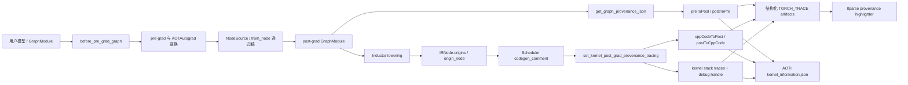
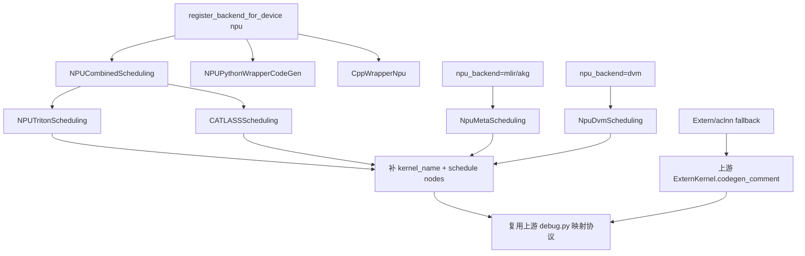
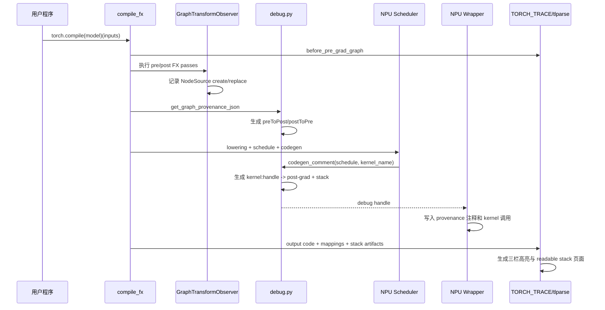

# PyTorch Feature 设计与实现分析

## 模块设计目标与背景

### 1. 调研对象与结论

本文调研 PyTorch 2.13 文档中的 **TorchInductor and AOTInductor Provenance Tracking**。它不是算子性能分析器，也不是 NPU 运行时 dump 工具，而是一条编译期可观测链路：把用户模型中的 FX 节点，经过 pre-grad/post-grad 图变换后，与 TorchInductor 最终生成的 kernel 或 extern 调用建立双向映射，并在 `tlparse` 中进行三栏高亮。

核心结论如下：

1. **上游数据模型与设备无关，可以直接复用。** `NodeSource`、pre-grad/post-grad 映射、IR `origins`、结构化日志、FX graph cache 和 AOTInductor `kernel_information.json` 都不依赖 CUDA。
2. **torch_npu 当前只能获得部分数据，尚不能完整显示 NPU 生成 kernel 的 provenance。** extern/aclnn 路径大体能复用上游逻辑，但 NPU Triton、CATLASS、MLIR、DVM 的代码生成点没有把真实 `kernel_name` 传给 `codegen_comment()`，因此 `cppCodeToPost`/`postToCppCode` 中缺少这些 kernel。
3. **静态 tlparse 高亮适配量较小。** 优先在 torch_npu codegen 侧补齐上游既有 hook 和 debug handle，不应在 Python 层另建一套映射协议。
4. **Profiler 时间线回填是第二阶段工作。** 上游实现内部依赖 Kineto/CUDA 的 trace 结构，而 torch_npu 导出的是 Ascend/CANN trace，文件结构、flow 名称和 kernel 关联方式都不同，不能直接复用 `torch._inductor.profiler.inductor_trace_handler`。

### 2. 分析基线

| 对象 | 本地基线 | 用途 |
| --- | --- | --- |
| PyTorch 源码 | `/home/z50063656/Benchmark/pytorch-upstream`，`8e86e0a23e3679c2bf3406cf0837fcb6297a5d9b`，2026-08-13 | 当前 `Benchmark/env.sh` 实际导入的 PyTorch 2.14 alpha 源码 |
| torch_npu 源码 | `/home/z50063656/Benchmark/pytorch-ascend`，`83cc452480c3546fd5cccf853bfe3a360ce9dbfc`，2026-08-14 | 当前 NPU codegen、wrapper 和 profiler 适配分析 |
| Python 运行时 | `/home/z50063656/envs/benchmark-py311/bin/python` | `torch 2.14.0a0+git8e86e0a`、`torch_npu 2.14.0` |
| NPU 运行时 | CANN 9.0.1，8 张 Ascend 910B2，每张 65536 MiB HBM | `npu-smi info` 实测均为 `Health: OK` |
| Triton Ascend | `triton-ascend 3.2.1` | torch_npu 当前 CI 的默认固定版本；运行时 `triton.__version__` 为 3.2.0 |
| 官方文档 | [本地保存页面](./TorchInductor%20and%20AOTInductor%20Provenance%20Tracking%20%E2%80%94%20PyTorch%202.13%20documentation.html) | 使用方式与产物清单 |

PyTorch 2.13 文档描述的架构与当前 2.14 alpha 源码一致，但行号和部分 NPU 分支已经演进。本文以当前实际运行环境为主基线，并把文档中的稳定概念作为功能契约。两个源码仓存在与本任务无关的工作区改动，调研过程未修改这些源码。

2026-08-17 已完成一次受控实机探测：物理 NPU 7 空闲，`torch.npu.is_available()` 为真，`torch.utils._triton.has_triton()` 在安装 Triton Ascend 后为真，NPU Inductor backend 可以导入。随后因当前机器另有进程同时修改 Python 环境，停止继续重试；文中会明确区分“源码确认”“环境探测通过”“尚未完成端到端执行”三种状态。

安装 `triton-ascend 3.2.1` 时，pip 按其依赖元数据把 `numpy` 调整为 1.26.4、`pytest` 调整为 8.3.2、`psutil` 调整为 6.0.0，并安装了 `triton 3.5.0` distribution。`triton-ascend` 会向同一个顶层 `triton` 包写入 Ascend backend，所以实际导入的 `triton.__version__` 是 3.2.0。这种“两个 distribution 共用一个 import package”的形态必须以实际导入和编译验证为准，不能只看 `pip show triton`。

### 3. 背景知识：先建立正确的心智模型

#### 从 eager 到 kernel

普通 eager 执行大致是“一条 PyTorch 算子调用一次 dispatcher，再选择 NPU kernel”。`torch.compile` 则先捕获一段 Python 为 FX graph，经过 AOTAutograd 和多轮图优化，再由 Inductor lowering 成内部 IR，最后由 scheduler 把多个节点融合成一个或多个后端 kernel。因此：

- 一个用户算子可能被分解成多个 post-grad 节点；
- 多个用户算子也可能被融合成一个 Triton/CATLASS/MLIR kernel；
- 生成代码中的 kernel 名通常不能直接还原到用户模型行号。

#### provenance 到底记录什么

Provenance 的含义是“来源关系”，不是数值正确性，也不是性能计时。它保存两段关系：第一段把 pre-grad FX 节点追踪到 post-grad FX 节点，第二段把 post-grad 节点追踪到最终 kernel。两段拼起来后，开发者才能从用户模型的一行代码一路定位到生成代码中的具体调用。

#### 静态 provenance 与 profiler timeline 的区别

静态 provenance 在编译时产生，回答“这个 kernel 是由哪些图节点生成的”。Profiler timeline 在运行时采样，回答“这个 kernel 何时执行、耗时多少、由哪个 host event 发射”。前者大体与设备无关；后者依赖 CUDA/Kineto 或 Ascend/CANN 的 trace schema，所以 NPU 的静态适配可以先完成，timeline 必须单独设计。

#### JIT Inductor 与 AOTInductor

`torch.compile` 通常在进程中即时编译并通过 `TORCH_TRACE` 输出结构化日志。AOTInductor 则提前编译和打包模型，provenance 会进入包内的 `kernel_information.json`。两条路径共享映射数据模型，但产物载体不同。

### 4. 工具解决的问题

一次 `torch.compile` 会经历多层图变换和融合。仅查看 `output_code.py` 时，开发者通常只能看到 `triton_poi_fused_*`、`cpp_fused_*` 或 extern 调用，难以回答：

- 这个 kernel 来自用户模型的哪一行？
- 一个原始算子在 post-grad 图中被拆成了哪些节点？
- 多个 post-grad 节点为什么被融合到同一个 kernel？
- AOTInductor 包中的 kernel 与原始算子如何对应？

Provenance Tracking 通过四组双向映射回答这些问题：

| 字段 | 方向 | 含义 |
| --- | --- | --- |
| `preToPost` | pre-grad -> post-grad | 原始/输入图节点经过变换后对应哪些节点 |
| `postToPre` | post-grad -> pre-grad | post-grad 节点追溯到哪些输入图节点 |
| `cppCodeToPost` | kernel key -> post-grad | 某次 kernel 调用覆盖哪些 post-grad 节点 |
| `postToCppCode` | post-grad -> kernel key | 某个 post-grad 节点进入了哪些 kernel 调用 |

这里的 `cppCodeToPost` 是历史命名，实际并不限于 C++ kernel，也可承载 Triton、NPU MLIR、DVM、CATLASS 和 extern kernel。

## 整体设计架构

### 1. 上游架构



这套设计刻意把“图变换来源”和“后端 kernel 来源”分成两段：

1. FX 层使用递归 `NodeSource` 保存图变换历史。
2. Inductor IR/scheduler 层使用 `origins` 把 post-grad 节点聚合到 kernel。
3. `debug.py` 在最终产物阶段把两段映射拼接起来。

因此 NPU 适配的正确位置是 scheduler/codegen 边界，而不是修改 `tlparse` 数据协议或在模型执行时重新猜测算子关系。

### 2. NPU 后端结构与接入位置



默认 NPU backend 在 `torch_npu/_inductor/__init__.py:129-138` 注册 `NPUCombinedScheduling`、`NPUPythonWrapperCodeGen` 和 `CppWrapperNpu`。`NPUCombinedScheduling` 再把节点分派给 NPU Triton 或 CATLASS。MLIR/AKG/DVM 则通过各自 backend 切换到 `NpuMetaScheduling` 或 `NpuDvmScheduling`。

### 3. 能力边界

| 能力 | 当前 NPU 状态 | 判断 |
| --- | --- | --- |
| pre-grad -> post-grad 映射 | 直接走上游 `GraphTransformObserver` 与 `NodeSource` | 可复用 |
| NPU 自定义 FX Pass | level 1 下由上游 observer 自动记录创建/替换 | 可复用 |
| extern/aclnn JIT 映射 | `ExternKernel.codegen_comment()` 为设备无关实现 | 基本可复用 |
| NPU Triton pointwise/reduction | 调用 `codegen_comment(node_schedule)` 时漏传 kernel 名 | 缺失 |
| NPU Triton template | 已取得 `kernel_name`，但漏传给 hook | 缺失 |
| NPU FlexAttention dK/dV template | 运行时在四个候选 kernel 间分派，但只有一次无名称注释 | 缺失，且需 wrapper 分支级处理 |
| NPU combo kernel | 漏传 kernel 名，且传入 combo wrapper node 而非返回的 `node_group` | 缺失 |
| CATLASS template | 没有调用 provenance hook | 缺失 |
| MLIR/AKG 普通融合 | `NpuMetaScheduling` 漏传 kernel 名 | 缺失 |
| DVM 普通融合/template | 继承路径和 template 路径都漏传 kernel 名 | 缺失 |
| 多流 extern out | wrapper override 与上游函数签名漂移 | 存在错误风险 |
| FX graph cache 命中 | 上游 cache key 和 artifact 重放已覆盖 level | 可复用，需 NPU 回归 |
| AOTI `kernel_information.json` | 上游打包逻辑设备无关 | 机制可复用，需 NPU 实机验证 |
| tlparse 静态三栏高亮 | JSON schema 本身无设备字段 | 预计可复用，需以真实 NPU log 验证前端匹配 |
| profiler timeline stack 回填 | 上游处理器依赖 CUDA/Kineto trace schema | 不可直接复用 |

### 4. 需要 PyTorch wheel 还是源码编译

结论：**第一阶段不需要完整源码编译 PyTorch。推荐用源码做分析和修改，用严格匹配的 wheel 环境做 NPU 运行验证。**

| 工作内容 | PyTorch 形态 | 是否需要完整编译 PyTorch |
| --- | --- | --- |
| 阅读 2.13/2.14 provenance 实现 | Git 源码 checkout | 否 |
| 运行官方功能、复现 NPU 缺口 | 匹配的 `torch` + `torch_npu` wheel | 否，首选 wheel |
| 修改 `torch_npu/_inductor/*.py` | PyTorch wheel + 可控的 torch_npu 源码构建/安装 | 否，只需处理 torch_npu 包 |
| 修改 `torch/_inductor/*.py` 且对应 nightly wheel 已包含基线 | nightly/dev wheel 或基于 wheel 的受控 Python 覆盖 | 通常否 |
| 修改 PyTorch C++、生成头文件或验证精确 commit | 从该 commit 构建并安装 PyTorch wheel | 是 |
| 发布最终兼容包 | 分别构建版本匹配的 torch/torch_npu wheel | 按改动范围决定 |

当前 `Benchmark/env.sh` 是混合形态：`torch.__file__` 指向 PyTorch 源码树，但部分 Python 包、C++ 扩展和 headers 来自 conda 环境。它适合快速源码联调，却不适合作为最终验收基线。本次 Triton launcher 的失败正是这种混合形态导致的：编译命令自动加入了 `/home/z50063656/Benchmark/pytorch-upstream/torch/include`，而完整 `ATen/ATen.h` 实际位于 wheel 的 `site-packages/torch/include`。

稳定环境后的推荐做法是：

1. 新建独立 conda 环境，不复用正在被其他进程修改的 `benchmark-py311`。
2. 安装同一兼容矩阵的 PyTorch wheel、torch_npu wheel、CANN runtime 与 Triton Ascend。
3. 先用未修改 wheel 跑本报告的最小脚本，建立 baseline。
4. 只修改 torch_npu 的 Python codegen 时，构建/安装 torch_npu 包即可，PyTorch wheel 保持不变。
5. 若必须锁定当前 `8e86e0a` 上游提交，则把该提交构建成 wheel 后安装，不要直接从源码目录导入并与已有 wheel headers 混用。

## 入口分析

### 1. 环境依赖与 Triton Ascend

当前 torch_npu 源码的 `.ci/docker/common/install_triton.sh` 默认固定 `TRITON_VERSION=3.2.1`，因此本环境选择该版本，而不是直接安装 triton-ascend `main` 分支的 3.6.0。aarch64 + Python 3.11 对应的 CI 安装方式是：

```bash
/path/to/clean-env/bin/python -m pip install --no-cache-dir \
  https://gitcode.com/Ascend/triton-ascend/releases/download/v3.2.1/triton_ascend-3.2.1-cp311-cp311-manylinux_2_27_aarch64.manylinux_2_28_aarch64.whl
```

应在隔离环境执行，因为该 wheel 对 `numpy==1.26.4`、`pytest==8.3.2`、`psutil==6.0.0` 等有固定依赖，会调整已有环境。安装后不要只检查 distribution 版本，要做运行时检查：

```python
import torch
import torch_npu
import triton
from torch.utils._triton import has_triton

print(torch.__version__, torch_npu.__version__, triton.__version__)
print(torch.npu.is_available(), has_triton())
```

四者必须同时匹配：PyTorch、torch_npu、Triton Ascend、CANN。`has_triton() == True` 只表示 backend 可发现，不代表 launcher、CANN 编译和设备执行已经成功。

### 2. 用户入口和标准用法

官方专页给出的最小流程是：

```bash
cargo install tlparse
TORCH_TRACE=/tmp/my_trace_log_dir INDUCTOR_PROVENANCE=1 python your_program.py
tlparse log_file_name.log --inductor-provenance
```

注意：专页明确要求把**具体 log 文件**直接交给 `tlparse`；`tlparse parse <folder> --inductor-provenance` 可能无法生成高亮器。通用 troubleshooting 页面还出现过 `pip install tlparse`，但针对本功能应以 provenance 专页的 Rust CLI 和 `--inductor-provenance` 参数为准。

NPU 示例程序可以写成：

```python
import torch
import torch_npu


class Demo(torch.nn.Module):
    def forward(self, x, y):
        a = torch.relu(x + y)
        return a * 2


device = "npu:0"
model = Demo().to(device)
x = torch.randn(1024, device=device)
y = torch.randn(1024, device=device)
compiled = torch.compile(model, backend="inductor")
compiled(x, y)
torch.npu.synchronize()
```

从 `/home/z50063656/tmp` 启动测试，避免在 torch_npu 源码目录中触发源码级联导入：

```bash
cd /home/z50063656/tmp
TRACE_DIR=$(mktemp -d /tmp/npu-prov-trace.XXXXXX)
TORCH_TRACE="$TRACE_DIR" \
INDUCTOR_PROVENANCE=1 \
TORCHINDUCTOR_UNIQUE_KERNEL_NAMES=1 \
python /home/z50063656/Tracking/npu_provenance_demo.py

LOG_FILE=$(find "$TRACE_DIR" -maxdepth 1 -type f -name '*.log' -print -quit)
tlparse "$LOG_FILE" --inductor-provenance
```

建议首次验证时同时隔离 Inductor cache，避免旧的、未携带 provenance 数据的产物干扰判断：

```bash
cd /home/z50063656/tmp
TRACE_DIR=$(mktemp -d /tmp/npu-prov-trace.XXXXXX)
CACHE_DIR=$(mktemp -d /tmp/npu-prov-cache.XXXXXX)
TORCH_TRACE="$TRACE_DIR" \
TORCHINDUCTOR_CACHE_DIR="$CACHE_DIR" \
INDUCTOR_PROVENANCE=1 \
TORCHINDUCTOR_UNIQUE_KERNEL_NAMES=1 \
python /home/z50063656/Tracking/npu_provenance_demo.py
```

### 3. 配置入口

`torch/_inductor/config.py:2968-2998` 定义了三个关键配置：

- `INDUCTOR_PROVENANCE=0`：关闭，默认值。
- `INDUCTOR_PROVENANCE=1`：normal，启用完整图变换观察和 pre-grad stack 缓存。
- `INDUCTOR_PROVENANCE=2`：basic，保留较轻量的映射/stack 能力，但不会让 `GraphTransformObserver` 因 provenance 单独激活。
- `TORCH_COMPILE_DEBUG=1`：兼容入口，未显式设置 `INDUCTOR_PROVENANCE` 时至少启用 level 1。
- `TORCH_COMPILE_DEBUG_EXTEND=1`：启用 profiler timeline 回填，并把有效 level 至少提升到 1。
- `TORCH_COMPILE_DEBUG_MAX_EVENTS`：时间线后处理事件数上限，默认 500000。

level 1 与 level 2 的源码可见差异是：

1. `compile_fx.py:2864-2869` 仅在 level 1 显式缓存 pre-grad 节点的 stack trace。
2. `graph_transform_observer.py:46-49` 仅在 level 1 因 provenance 激活图变换 hook。

上游源码没有给出比 `normal/basic` 更完整的稳定语义说明，因此适配和验收应以 level 1 为主，不能把 level 2 当作完全等价模式。

### 4. 编译入口

`torch/_inductor/compile_fx.py::run_pre_grad_passes()` 是图级追踪入口：

1. 发出 `before_pre_grad_graph` artifact，并附加 `id(model_.graph)`。
2. 保存 `_pre_grad_graph_id`，作为递归追踪的边界标识。
3. level 1 时缓存输入图 stack trace。
4. 执行 pre-grad passes，再发出 `after_pre_grad_graph`。

`torch/_inductor/compile_fx.py::_compile_fx_inner()` 在 post-grad 图稳定后：

1. 发出 `inductor_post_grad_graph`。
2. 调用 `get_graph_provenance_json()` 序列化每个 `call_function` 节点的 `from_node`。
3. 调用 `create_mapping_pre_post_grad_nodes()` 递归展开来源链，生成 `preToPost` 和 `postToPre`。

### 5. 后端代码生成入口

所有后端应在“kernel 名称已确定、scheduler nodes 已确定、kernel 调用即将写入 wrapper”时调用：

```python
self.codegen_comment(node_schedule, kernel_name)
```

上游 `TritonScheduling.codegen_comment()` 和 `BaseScheduling.codegen_comment()` 只有在 `kernel_name` 为真时才调用 `set_kernel_post_grad_provenance_tracing()`。因此只写 `self.codegen_comment(node_schedule)` 会生成普通 source-node 注释，却不会写入 provenance 映射，这是当前 NPU 主要问题的直接原因。

## 完整调用链分析

### 1. 图节点来源链

`torch/fx/traceback.py::NodeSource` 保存：

- 节点名、target 和所属 graph id；
- 发生变换的 pass 名；
- `create`/`replace` 动作；
- 递归的上一层 `from_node`。

`GraphTransformObserver` 在 level 1 下注册 create/erase/replace hook。torch_npu 的 `pre_grad_custom_pass` 和 `post_grad_custom_post_pass` 都由上游 observer 包裹，所以 NPU 自定义 FX Pass 中大量 `graph.call_function()`/`graph.create_node()` 不需要逐个手写 provenance 元数据。发生 `replace_all_uses_with()` 时，replace hook 会把被替换节点作为 `NodeSource` 接到新节点上。

### 2. post-grad 到 kernel 的来源链

Inductor lowering 创建 `IRNode` 时，`torch/_inductor/ir.py::IRNode.__post_init__()` 保存当前 `origins`。scheduler 融合多个 IR node 后，`set_kernel_post_grad_provenance_tracing()`：

1. 为每次调用递增全局 debug handle；
2. 把 key 标准化为 `<kernel_name>:<handle>`；
3. 遍历 scheduler node 对应 IR node 的 `origins`；
4. 写入 kernel -> post-grad 节点集合；
5. 调用 `IRNode.get_stack_traces()` 收集用户代码 stack；
6. 让 wrapper 输出 `[Provenance debug handles] <kernel_name>:<handle>` 注释。

debug handle 很重要：同名 kernel 可能被调用多次，单用函数名无法区分不同调用。tlparse 依赖 mapping key 与 output code 中的 handle 注释精确对应。

### 3. extern kernel 路径

`torch/_inductor/ir.py::ExternKernel.codegen_comment()` 会自动解析 kernel 名，并以 `is_extern=True` 调用统一追踪函数。extern 路径额外记录：

- `origin_node` 或 `origins`；
- `extern_semantic_key`；
- 输入/输出 shape 和 dtype；
- stack traces。

因此普通 NPU aclnn fallback 不需要另建映射逻辑。只要 torch_npu wrapper 继续调用上游 `generate_extern_kernel_alloc/out()`，静态 provenance 就能复用这一段。

### 4. artifact 生成与缓存

`dump_inductor_provenance_info()` 合并四组映射，并写入 `version: 2.0`。`compile_fx.py:1755-1780` 通过 structured trace 发出：

- `inductor_provenance_tracking_node_mappings`；
- `inductor_provenance_tracking_kernel_stack_traces`。

随后它们被保存进 `CompiledFxGraph`。`codecache.py:1597-1604` 把有效 provenance level 和 timeline flag 纳入 cache key；`codecache.py:2145-2190` 在 cache hit 时重新发出 output code、post-grad graph、mapping 和 stack artifacts。因此正确适配后，cache miss 与 cache hit 都应获得一致结果。

AOTInductor 打包时，`codecache.py:3607-3614` 调用 `create_kernel_information_json()`，生成包含 stack、pre/post 节点、extern 语义键和 shape/dtype 的 `kernel_information.json`。

### 5. 结构化日志与 tlparse

官方页面列出的高亮器输入为：

1. `before_pre_grad_graph.txt`
2. `after_post_grad_graph.txt`，当前源码 artifact 名为 `inductor_post_grad_graph`
3. `inductor_aot_wrapper_code.txt`
4. `inductor_output_code.txt`
5. `inductor_provenance_tracking_node_mappings.json`
6. `inductor_provenance_tracking_kernel_stack_traces.json`，用于 readable HTML 源码定位

执行 `tlparse <log> --inductor-provenance` 后，应出现额外的 `Provenance Tracking` 入口。即使不加该参数，mapping JSON 仍应出现在普通 tlparse 产物索引中。

### 6. 端到端时序



### 7. 当前 NPU 断点的源码证据

#### NPU Triton

`torch_npu/_inductor/codegen/scheduling.py` 已经取得真实 kernel 名，但当前有四类路径没有按契约传给 hook：

- 普通 pointwise/reduction：178 行定义 kernel，194 行调用 `self.codegen_comment(node_schedule)`。
- 普通 template：309 行得到 `kernel_name`，311 行仍不传名称。
- FlexAttention dK/dV 复合 template：343-376 行定义 legacy、tasklist、tasklist-no-split、reduce 四个 kernel，393-412 行把四个名字交给运行时分派器，但 422 行只有一次 `self.codegen_comment([template_node])`。
- combo：439 行得到 `kernel_name`，440 行传 `[combo_kernel_node]` 且不传名称；应追踪内部 subkernel/scheduler nodes，而不是 combo wrapper node 本身。

结果是生成代码中可能仍有 `Topologically Sorted Source Nodes` 注释，但 mapping JSON 不包含这些 NPU Triton kernel。FlexAttention 还多一层问题：四个候选 kernel 的调用写在 `NPUPythonWrapperCodeGen.generate_flex_attention_dkdv_dispatch()` 的不同运行时分支中，不能只在 scheduler 末尾补四个连续注释；需要让 wrapper 在每个 `.run()` 前写入对应 handle，或者为分派器提供等价的分支级 provenance 接口。

#### CATLASS

`torch_npu/_inductor/codegen/catlass/catlass_scheduling.py:206-223` 定义并调用 CATLASS kernel，中间没有 `self.codegen_comment(node_schedule, kernel_name)`。上游 CUTLASS 在对应 call 前明确调用该 hook。

#### MLIR/AKG/DVM

`NpuMetaScheduling.codegen_node_schedule()` 在 `meta_kernel.py:503` 得到名称，519 行只调用 `self.codegen_comment(node_schedule)`。AKG/MLIR 继承该实现，因此都会漏映射。

`NpuDvmScheduling.codegen_template()` 在 `dvm/mlir_fusion.py:332` 得到名称，336 行仍只传 schedule。DVM 普通融合继承 `NpuMetaScheduling`，两条路径都需要修复。

#### 多流 extern wrapper

当前上游 `_generate_extern_kernel_out_helper()` 的末参数为 `stack_traces: OrderedSet[str] | None`。NPU override 在 `wrapper.py:455-483` 仍命名并标注为 `debug_handle: Optional[int]`，且多流路径把它传给 `write_provenance_debug_handle()`。实际调用者传入的是 stack trace 集合，不是整数，会生成错误的 handle 注释。

另外，上游在 timeline 模式下会用 `define_extern_kernel_profile_wrapper()` 给 extern 调用生成可关联的 profiler 名称；NPU 多流分支绕过了这段逻辑。

#### profiler timeline

上游 `torch/_inductor/profiler.py` 期望：

- 根对象包含 `traceEvents`；
- flow 类型为 `fwdbwd`/`ac2g`；
- runtime category 包含 `cuda_runtime`、`cuLaunchKernel`、`cuda_driver`；
- device kernel category 为 `kernel`，并可按 `External id` 关联。

torch_npu `TraceViewParser` 输出的是事件 list，并使用：

- `torch_to_npu` flow 名；
- `async_npu` flow category；
- CANN `HostToDevice` flow 来建立 ACL -> NPU kernel 关系。

同时 NPU `_KinetoProfile.export_chrome_trace()` 只接受 `output_path`，而上游 handler 会额外传 `use_python_export`。所以现有 handler 在 API 和数据格式两层都不兼容。

### 8. 当前实机验证进度

最小脚本见 [npu_provenance_demo.py](./npu_provenance_demo.py)，模型为可融合的 `add -> relu -> mul`。测试严格从 `/home/z50063656/tmp` 启动，并把 trace、debug 和 cache 隔离到临时目录。

| 阶段 | 结果 | 证据/含义 |
| --- | --- | --- |
| NPU 发现 | 通过 | 8 张 910B2 均健康；物理设备 7 当时无进程 |
| Python backend 发现 | 通过 | `torch.npu.is_available() == True`，`has_triton() == True`，`torch_npu._inductor` 可导入 |
| FX 捕获和 NPU Inductor codegen | 通过 | 生成 `triton_poi_fused_add_mul_relu_0`，设备属性为 `npu/Ascend910B2` |
| Triton Ascend device binary | 部分通过 | cache 中已经生成多组 `.ttir`、`.ttadapter` 和 `.npubin` |
| launcher 预编译 | 失败 | g++ 找不到 `ATen/ATen.h`；命令错误地只加入源码树 `torch/include` |
| NPU kernel 执行和数值比对 | 未到达 | launcher 失败发生在第一次执行前 |
| 完整 provenance JSON/tlparse | 未完成 | `compile_to_module()` 未成功返回，structured provenance artifacts 尚未正常提交 |

即使执行未完成，生成的 `output_code.py` 已提供与源码分析一致的旁证：它包含 `Topologically Sorted Source Nodes: [added, activated, mul]` 和 NPU Triton kernel 调用，却没有 `[Provenance debug handles]` 注释。这正符合 `codegen_comment(node_schedule)` 未传 `kernel_name` 时“普通注释存在、kernel mapping 不产生”的上游行为。

本轮运行目录为 `/home/z50063656/tmp/npu-provenance.WVlGWX`。该目录保留了 trace、debug、生成代码和 Triton cache，后续环境稳定后可作为失败样本分析；不要把它当作成功的 provenance 验收产物。

## 扩展点分析

### 1. 第一阶段：静态 tlparse 高亮的最小改造

建议只沿用上游现有 hook，不新增 NPU 专属 JSON 字段。

#### 改造点 A：NPU Triton

目标文件：`torch_npu/_inductor/codegen/scheduling.py`

```python
# 普通 kernel
self.codegen_comment(node_schedule, final_kernel.kernel_name)

# template
self.codegen_comment(node_schedule, kernel_name)

# combo: use the node_group returned with each generated kernel
self.codegen_comment(node_group, kernel_name)
```

这里应模仿上游 Triton codegen，使用最终会被 wrapper 调用的 kernel 名。combo 循环当前丢弃 `generate_combo_kernel_code()` 返回 tuple 的第三项；应保留该 `node_group`，并同时用于 `define_kernel()` 和 `codegen_comment()`，否则统一追踪函数无法遍历真实 scheduler nodes。

FlexAttention dK/dV 不能套用上面的一行修复。需要先为 legacy、tasklist、tasklist-no-split、reduce 四个名字分别建立 `[template_node] -> kernel` 映射，再把四个 debug handle 传入 `generate_flex_attention_dkdv_dispatch()`，由 wrapper 在各自 `.run()` 的条件分支内写入对应注释。这样静态 output code 才能区分实际可能执行的候选 kernel。

#### 改造点 B：CATLASS

目标文件：`torch_npu/_inductor/codegen/catlass/catlass_scheduling.py`

在真实 kernel call 之前加入：

```python
self.codegen_comment(node_schedule, kernel_name)
```

位置与上游 `CUTLASSScheduling.codegen_template()` 保持一致，避免 benchmark-only 的 `only_src_code=True` 路径污染全局追踪状态。

#### 改造点 C：MLIR/AKG/DVM

目标文件：

- `torch_npu/_inductor/ascend_npu_ir/ascend_npu_ir/npu/codegen/meta_kernel.py`
- `torch_npu/_inductor/dvm/mlir_fusion.py`

将普通融合和 DVM template 的调用改为：

```python
self.codegen_comment(node_schedule, kernel_name)
self.codegen_comment(snodes, kernel_name)
```

修复基类 `NpuMetaScheduling` 后，MLIR 与 AKG 继承路径可同时生效。

#### 改造点 D：多流 extern wrapper 对齐

目标文件：`torch_npu/_inductor/codegen/wrapper.py`

1. 把 override 参数改为 `stack_traces: OrderedSet[str] | None = None`，与当前 PyTorch 上游签名一致。
2. 删除多流分支中把该参数传给 `write_provenance_debug_handle()` 的逻辑；extern handle 已由 `ExternKernel.codegen_comment()` 生成。
3. timeline 未启用时直接保持当前多流调用。
4. timeline 启用时调用 `define_extern_kernel_profile_wrapper()`，再输出带多流缩进的 wrapper 名称。

建议增加 override 签名一致性单测，防止后续升级 PyTorch 时再次静默漂移。

### 2. tlparse 是否需要修改

第一阶段应先按“tlparse 零修改”验证，理由是：

- mapping schema 的 key 是字符串，不带 CUDA/NPU 枚举；
- `cppCodeToPost` 历史字段本身允许任意后端 kernel 名；
- 真实调用通过 `<kernel_name>:<handle>` 与 output code 注释关联。

只有在真实 NPU log 证明前端按 `triton_`/`cpp_` 白名单过滤时，才应修改 tlparse，使 kernel 类型识别接受 `mlir_`、`dvm_`、`catlass_` 等前缀。由于本次未取得 tlparse 源码副本，这一点属于待验证项，不能在当前证据下断言无需任何前端改动。

### 3. 第二阶段：NPU profiler timeline provenance

建议在 torch_npu 内新增 NPU 专用 handler/adapter，再评估是否将通用接口上推 PyTorch：

1. 使用 `torch_npu.profiler.profile` 和只接收路径的 `export_chrome_trace(path)`。
2. 同时接受 Ascend trace 的顶层 list 和 Chrome trace 的 `{"traceEvents": [...]}` 形式。
3. 识别 `torch_to_npu`/`async_npu` flow，或直接复用 `FwkCANNRelationParser` 已建立的 torch op -> kernel 关系。
4. 把 CANN kernel event 名与 `get_kernel_information_jsons()` 的 `<kernel_name>:<handle>` 关联。
5. extern 路径使用 `extern_kernels_*` profile wrapper，保证 CPU 侧调用名可定位。
6. 把 stack 写回 CANN kernel event 的 `args.stack`，最后按原格式导出。
7. 保留上游事件数上限、异常不影响模型执行、处理后清理全局状态等防护。

难点不在 JSON 写入，而在“生成 kernel 名”和“CANN timeline 展示名”是否完全一致。必须用 Triton、CATLASS、aclnn、MLIR/DVM 各一条真实 trace 验证；若 CANN 展示的是设备算子名而不是 Inductor kernel 名，则需要使用 `HostToDevice` flow 和 CPU wrapper event 做间接关联，不能只按字符串匹配。

### 4. 测试设计

建议新增 `test/_inductor/test_provenance_tracing.py`，测试均从 `/home/z50063656/tmp` 启动。

| 层级 | 用例 | 关键断言 |
| --- | --- | --- |
| 静态单测 | mock `set_kernel_post_grad_provenance_tracing` | Triton/CATLASS/MLIR/DVM/extern 均传真实 name 与真实 scheduler nodes |
| NPU Triton E2E | add/relu/mul 融合 | `cppCodeToPost` 含 `triton_*:<handle>`，output code 有同 handle |
| template | matmul + epilogue | template kernel 能追溯到 mm 与 epilogue 节点 |
| FlexAttention dK/dV | 构造 legacy/tasklist 分支 | 四个候选调用各有独立 mapping/handle，分支内注释位置正确 |
| combo | 三个独立 pointwise 输出 | 每个 combo kernel 映射到对应 `node_group` |
| extern/aclnn | mm/addmm 或 fallback op | `extern_kernels.*` 含 post/pre 节点、shape、dtype |
| 多流 extern | `ENABLE_PARALLEL_SCHEDULER=true` | 不出现集合形式假 handle，调用缩进与语义不变 |
| CATLASS | 开启 CATLASS 条件下 matmul | CATLASS key 与 stack 存在；依赖缺失时明确 skip |
| MLIR/AKG | `options={"npu_backend": "mlir"}` | `mlir_*:<handle>` 存在 |
| DVM | `options={"npu_backend": "dvm"}` | 普通融合和 template 都有 `dvm_*:<handle>` |
| cache | 同模型编译两次 | cache miss/hit 的 mappings 与 stack 等价 |
| AOTI | compile/package/load | 包内有 `kernel_information.json`，模型结果正确 |
| backward | 带梯度模型 | 前向、反向 kernel 均有 stack 或合法映射 |
| timeline 单测 | 合成 Ascend trace list | `torch_to_npu` flow 对应 kernel 被写入 stack |
| timeline E2E | NPU profiler 导出 | trace 可被 Perfetto 打开且 kernel stack 可见 |

验收不能只检查“文件存在”，至少要满足：

1. 四组 mapping 非空且双向一致。
2. mapping 中每个 kernel key 都能在 output/wrapper code 找到相同 debug handle。
3. stack trace 至少包含模型 forward 中的预期源码行。
4. 开关关闭时不产生 kernel provenance，且执行结果、kernel 数量和调度不变。
5. cache hit、动态 shape 重编译和异常路径不会串用上一次编译的全局状态。

### 5. 风险与约束

- **全局状态隔离：** provenance 当前使用模块级字典和计数器。新增 codegen hook 必须遵循上游 `reset_provenance_globals()` 生命周期，避免并行编译串数据。
- **autotune 路径：** benchmark-only 代码生成不能记录最终 mapping，否则会出现未执行 kernel 或重复 handle。
- **唯一 kernel 名：** profiler timeline 尤其依赖 `TORCHINDUCTOR_UNIQUE_KERNEL_NAMES=1`；静态模式仍应使用 debug handle 区分重复调用。
- **性能开销：** level 1 会复制递归 `NodeSource` 并保存 stack，只应按需开启，不应作为生产默认配置。
- **隐私：** `TORCH_TRACE` 会保存模型图、生成代码和用户源码栈，日志可能包含模型结构、文件路径或业务代码，不应直接上传到不受控位置。
- **版本耦合：** torch_npu override 上游内部类和函数时，要把签名一致性列入 PyTorch 升级检查项。
- **命名误导：** 不要因为字段叫 `cppCodeToPost` 就另增 `npuCodeToPost`；改变 schema 会迫使 tlparse 分叉。

### 6. 推荐实施顺序

1. 先在全 wheel 的隔离环境复现普通 NPU Triton 缺口，排除源码/wheel 混合加载问题。
2. 修 NPU Triton 普通/template/combo hook，跑最小 E2E，确认现有 tlparse 能直接高亮。
3. 单独设计 FlexAttention dK/dV 的分支级 handle 传递，不把它混成普通 template 的一行修改。
4. 补 CATLASS、MLIR/AKG、DVM hook，建立后端参数化测试。
5. 对齐多流 extern wrapper 签名，补 cache hit 和 AOTI 测试。
6. 收集真实 NPU tlparse 产物；只有发现前端过滤时才改 tlparse。
7. 最后单独设计 NPU timeline adapter，不把它作为静态高亮功能上线的阻塞项。

## 总结

TorchInductor Provenance Tracking 的主体已经是跨设备设计：FX provenance、IR origins、mapping schema、structured trace 和 AOTI metadata 都可以由 NPU 直接复用。当前 torch_npu 的核心问题不是缺少一套 NPU provenance 算法，而是多个自定义 codegen 分支没有遵循上游 `codegen_comment(schedule, kernel_name)` 契约，以及多流 wrapper 与上游接口发生漂移。

这项工作的首选运行形态是**匹配版本的 wheel 隔离环境**，不是先完整编译 PyTorch。PyTorch 和 torch_npu 源码 checkout 用于理解、定位和提交修改；只有改动 PyTorch 原生代码或必须锁定没有对应 wheel 的精确提交时，才构建 PyTorch wheel。当前源码树 Python + wheel headers/扩展的混合环境已经实证会影响 Triton launcher，因此不能用它对功能做最终判定。

因此推荐把交付拆成两层：

- **第一层，静态 tlparse 高亮：** 补齐 NPU Triton/CATLASS/MLIR/AKG/DVM hook 和多流 extern 对齐，改动集中、风险可控，预计无需修改 PyTorch 的 mapping schema。
- **第二层，profiler timeline：** 基于 Ascend `torch_to_npu`/`HostToDevice` 关联机制实现 NPU 专用 adapter，不能直接套用 CUDA/Kineto 后处理器。

完成第一层后，用户应能用与 CUDA/CPU 相同的命令生成 NPU provenance 报告，并从原始 FX 节点一路高亮到 NPU 生成 kernel；第二层则进一步把相同用户源码 stack 回填到 Ascend profiler 时间线。

### 本次已完成与待完成

已完成：官方文档用法解析、PyTorch 完整调用链、当前 torch_npu 各后端静态差距、8 张 910B2 环境探测、Triton Ascend 安装与 backend 发现、最小 NPU codegen 运行、失败分层诊断，以及可重复执行的 demo 脚本。

待环境稳定后完成：在全 wheel 隔离环境跑通 launcher 和数值比对，取得完整 mapping/stack artifacts，用 `tlparse --inductor-provenance` 验证 NPU 静态高亮，再进入 torch_npu 代码修改和回归测试。当前没有修改 PyTorch 或 torch_npu 源码。

### 参考源码

- PyTorch 文档：`docs/source/user_guide/torch_compiler/torch.compiler_inductor_provenance.md`
- 配置：`torch/_inductor/config.py::trace.provenance_tracking_level`、`effective_provenance_tracking_level()`
- 图编译入口：`torch/_inductor/compile_fx.py::run_pre_grad_passes()`、`_compile_fx_inner()`、`fx_codegen_and_compile()`
- FX 来源模型：`torch/fx/traceback.py:82-190, 517-535, 595-608`
- 图变换 observer：`torch/fx/passes/graph_transform_observer.py:46-60, 188-244`
- kernel 映射：`torch/_inductor/debug.py::create_mapping_pre_post_grad_nodes()`、`set_kernel_post_grad_provenance_tracing()`、`dump_inductor_provenance_info()`
- IR origins/stack：`torch/_inductor/ir.py:671-730, 7246-7261`
- 上游 codegen 范式：`torch/_inductor/codegen/triton.py::TritonScheduling.codegen_comment()`
- cache/AOTI：`torch/_inductor/codecache.py:1597-1604, 2145-2190, 3607-3614`
- 上游 timeline：`torch/_inductor/profiler.py`
- NPU backend 注册：`torch_npu/_inductor/__init__.py:71-199`
- NPU Triton：`torch_npu/_inductor/codegen/scheduling.py:178-194, 240-317, 319-424, 426-507`
- NPU CATLASS：`torch_npu/_inductor/codegen/catlass/catlass_scheduling.py:155-229`
- NPU MLIR/AKG：`torch_npu/_inductor/ascend_npu_ir/ascend_npu_ir/npu/codegen/meta_kernel.py:294-520`
- NPU DVM：`torch_npu/_inductor/dvm/mlir_fusion.py:320-338`
- NPU wrapper：`torch_npu/_inductor/codegen/wrapper.py:222-349, 455-483`
- NPU profiler trace：`torch_npu/profiler/profiler.py:35-85`、`torch_npu/profiler/analysis/prof_view/_trace_view_parser.py:71-104`
