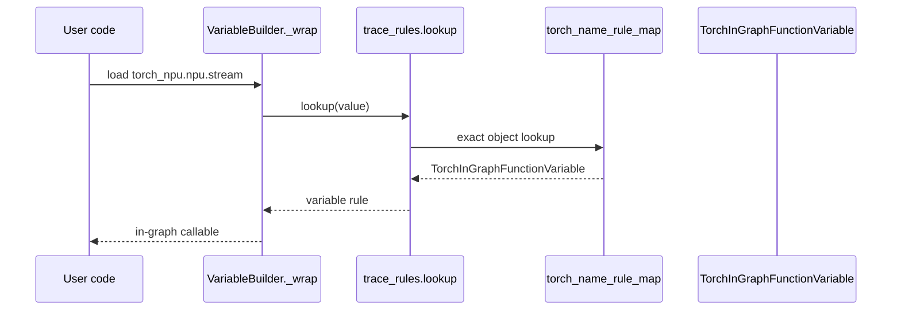

# torch_npu Monkey Patch 消除评审报告（1/4：stream 函数路由）

> 依据 [`patch消除评审模板.md`](patch消除评审模板.md) 填写。本报告只评审
> `patch_SkipFunctionVariable`；Stream/Event 类、autocast 和 Tensor 类型另分三份报告。

---

## 基本信息

| 项目 | 内容 |
|------|------|
| Patch 名称 | `patch_SkipFunctionVariable` |
| 原始提交人 | 王姜奔；历史功能首引入提交 `8bdf0d8f7f41` |
| 消除提交人 | 待提交时填写 |
| 提交日期 | 待提交时填写，不以运行环境日期代填 |
| 目标分支 | PyTorch detached HEAD `0c4461ed5d95`；torch_npu detached HEAD `741ee42ce188`，实际提交分支待填 |
| 相关 Issue | 源码和现有交付文档中未发现明确证据，待填 |
| 原始 PR | torch_npu `!8361`：`fix torch_npu.npu.amp.autocast/torch.device/torch_npu.stream bug in dynamo` |

---

## 1. Patch 消除概述

### 1.1 Patch 原始背景

原 Patch 只解决一个问题：NPU `stream` 未在 Dynamo 规则查表阶段命中，
而是落入 Skip 类。本节只保留说明该问题所需的路由片段，完整代码见 1.2、1.3 和 2.2。

#### 1. NPU 原来的路由如何落入 `SkipFunctionVariable`

原 Patch 首次引入于 torch_npu 提交 `8bdf0d8f7f41`。当时该类名为
`SkipFilesVariable`，后续随 PyTorch 上游更名为 `SkipFunctionVariable`，路由语义不变。

当时 NPU `stream` 使用 `@contextlib.contextmanager`：

代码框文件：`torch_npu/torch_npu/npu/utils.py`（原 Patch 引入提交
`8bdf0d8f7f41`，与路由相关的连续源码段）

```python
@contextlib.contextmanager
def stream(stream):
```

Dynamo 看到的是 `contextlib.py` 中的包装函数，而 `contextlib` 在旧版
`BUILTIN_SKIPLIST` 中：

代码框文件：`pytorch/torch/_dynamo/skipfiles.py`（历史 PyTorch 提交
`ba4c18f527e`，相关成员摘录，其他成员省略）

```python
BUILTIN_SKIPLIST = (
    # ...
    contextlib,
    # ...
)
```

因 NPU `stream` 没有先命中 `trace_rules.lookup`，`skipfiles.check()` 命中后构造
Skip 类：

代码框文件：`pytorch/torch/_dynamo/variables/builder.py`（历史 PyTorch 提交
`ba4c18f527e`，Skip 选路关键条件）

```python
elif (
    is_function(value)
    and skipfiles.check(value, is_inlined_call=True)
    # ... 包装函数豁免条件
):
    return SkipFilesVariable(
        value,
        skipfiles.check_verbose(value, is_inlined_call=True).reason,
        source=self.source,
    )
```

torch_npu 替换了 Skip 类的 `__new__`。执行 `SkipFilesVariable(...)` 时，Python 会先调用
`__new__`，所以原生 Builder 虽然已经选择 Skip 类，仍会先进入 torch_npu 的拦截函数：

代码框文件：`torch_npu/torch_npu/utils/_dynamo.py`（原 Patch 的关键拦截片段）

```python
def SkipFilesVariable__new__(cls, value, reason, **kwargs):
    if value in [
        torch.npu.stream,
        torch_npu.npu.stream,
        torch_npu.npu.utils.stream,
    ]:
        return TorchInGraphFunctionVariable(value, **kwargs)
    return cls.__new__(value, reason, **kwargs)
```

命中后，`__new__` 直接返回 `TorchInGraphFunctionVariable`，不会继续执行 Skip 类的
`__init__`。因此原路由为：

代码框类型：原 Patch 路由示意（非仓库源码）

```text
NPU stream 的 contextlib 包装函数
→ trace rule/原生 allow 未命中
→ contextlib.py 命中 skipfiles
→ 构造 SkipFilesVariable（后更名为 SkipFunctionVariable）
→ patched __new__ 拦截
→ TorchInGraphFunctionVariable
```

#### 2. 原生设备在这里如何处理

CUDA 不依赖 `SkipFunctionVariable.__new__` Patch，而是直接登记
`torch.cuda.stream`：

代码框文件：`pytorch/torch/_dynamo/trace_rules.py`（历史 PyTorch 提交
`ba4c18f527e`，`torch_non_c_binding_in_graph_functions` 中的连续源码段）

```python
"torch.cuda.stream",
```

该表的目标是 `TorchInGraphFunctionVariable`。Builder 先查询规则，命中后直接
返回，不再进入 `skipfiles.check()`：

代码框文件：`pytorch/torch/_dynamo/variables/builder.py`（历史 PyTorch 提交
`ba4c18f527e`，原生规则命中分支）

```python
elif trace_rules.lookup(value) is not None:
    return trace_rules.lookup(value).create_with_source(value, source=self.source)
```

代码框类型：原生 CUDA 路由示意（非仓库源码）

```text
torch.cuda.stream
→ trace_rules.lookup 命中
→ TorchInGraphFunctionVariable
→ 不进入 skipfiles
```

因此，消除 NPU Patch 的正确方向就是复用原生设备方式：让 NPU `stream` 在 Dynamo
trace-rule 白名单阶段进入 `TorchInGraphFunctionVariable`，而不是在 Skip 类构造阶段二次拦截。

当前 torch_npu 基线已经登记 `"torch.npu.stream"`，且 `stream()` 已不再使用
`@contextlib.contextmanager`。原 Patch 对应的历史 Skip 条件已经消失；补齐公开名称后即可删除
`SkipFunctionVariable.__new__` Patch。


### 1.2 Patch 对应的社区代码

本节展示消除方案所面对的当前社区实现；原 Patch 首次引入时的旧版
`VariableBuilder`/`skipfiles` 路由已经在 1.1 单独展示，二者不能混为同一时期的源码。

本节所有 `pytorch/` 代码均取自未应用候选修改的 upstream HEAD `0c4461ed5d95`；
候选修改后源码只在 2.2 展示。

| 社区代码 | 职责 |
| --- | --- |
| `pytorch/torch/_dynamo/trace_rules.py::torch_name_rule_map` | 完整名称到 VariableTracker 类型的函数规则入口 |
| `pytorch/torch/_dynamo/trace_rules.py::get_torch_obj_rule_map` | 把字符串名称解析成实际 Python 对象 |
| `pytorch/torch/_dynamo/trace_rules.py::lookup_callable` | 处理 allow/disallow/polyfill/builtin 可调用对象 |
| `pytorch/torch/_dynamo/trace_rules.py::_lookup_inner` | 合并手工规则、文件 skip 规则和默认回退 |
| `pytorch/torch/_dynamo/variables/builder.py::VariableBuilder._wrap` | 把 stream 函数对象包装成查表所得 VariableTracker |

NPU API 入口：

- `torch_npu/torch_npu/npu/utils.py::stream`
- `torch.npu.stream`（torch_npu 注册后暴露的公开别名）

代码框文件：评审用例（非仓库源码）

```python
stream = torch.npu.Stream()

@torch.compile(backend="eager", fullgraph=True)
def fn():
    return torch.npu.stream
```

`pytorch/torch/_dynamo/variables/builder.py::VariableBuilder._wrap` 中负责函数对象选路的完整分支：

代码框文件：`pytorch/torch/_dynamo/variables/builder.py`（upstream HEAD）

```python
elif is_function_or_wrapper(value):
    # pyrefly: ignore[not-callable, bad-argument-count]
    return trace_rules.lookup(value)(value)
```

`pytorch/torch/_dynamo/trace_rules.py::get_torch_obj_rule_map` 完整源码：

代码框文件：`pytorch/torch/_dynamo/trace_rules.py`（upstream HEAD）

```python
@functools.cache
def get_torch_obj_rule_map() -> dict[Any, type["VariableTracker"]]:
    d: dict[Any, type[VariableTracker]] = {}
    for m in torch_name_rule_map:
        for k, v in m.items():  # type: ignore[attr-defined]
            if ".py#" not in k:
                obj = load_object(k)
            else:
                torch_dir = _module_dir(torch)
                if torch_dir is None:
                    continue
                obj = torch_dir + k[len("torch/") :]
            if obj is not None:
                if is_lru_cache_wrapped_function(obj):
                    obj = obj.__wrapped__
                if obj in d and d[obj] != v:
                    raise AssertionError(
                        f"Duplicate torch object {obj} with different rules: {v}, {d[obj]}"
                    )
                else:
                    d[obj] = v
    return d
```

`pytorch/torch/_dynamo/trace_rules.py::_lookup_inner` 中优先级最高的完整对象查表阶段：

代码框文件：`pytorch/torch/_dynamo/trace_rules.py`（upstream HEAD）

```python
try:
    can_hash = hashable(obj)
except Exception:
    can_hash = False
if not can_hash:
    if reasons is not None:
        reasons.add("obj is not hashable")
    return None
if obj is not None:
    if is_aten_op_or_tensor_method(obj):
        return TorchInGraphFunctionVariable
    rule = get_torch_obj_rule_map().get(obj, None)
    if rule is not None:
        if reasons is not None:
            reasons.add("get_torch_obj_rule_map")
        return rule
elif name is not None and filename is not None and not is_direct_call:
    if name.startswith(TORCH_DYNAMO_RESUME_IN_PREFIX):
        rule = get_torch_obj_rule_map().get(
            filename + "#" + TORCH_DYNAMO_RESUME_IN_PREFIX, None
        )
    else:
        rule = get_torch_obj_rule_map().get(filename + "#" + name, None)
    if rule is not None:
        if reasons is not None:
            reasons.add("get_torch_obj_rule_map")
        return rule
elif name == "<listcomp>":
    if reasons is not None:
        reasons.add("inlining frame from list comprehension")
    return UserFunctionVariable
```

这里先查 `torch_name_rule_map`，命中后直接返回规则，不再进入后续文件 skip 判断。

`pytorch/torch/_dynamo/trace_rules.py::lookup_callable` 完整源码：

代码框文件：`pytorch/torch/_dynamo/trace_rules.py`（upstream HEAD）

```python
def lookup_callable(obj: Callable[..., Any]) -> type[VariableTracker] | None:
    if not hashable(obj):
        return None
    if is_callable_disallowed(obj):
        return SkipFunctionVariable
    if is_callable_allowed(obj):
        return TorchInGraphFunctionVariable
    if is_polyfilled_callable(obj):
        return PolyfilledFunctionVariable
    if obj in BUILTIN_CALLABLES:
        return BUILTIN_CALLABLES[obj]
    if is_builtin_callable(obj):
        return BuiltinVariable
    return None
```

`pytorch/torch/_dynamo/variables/functions.py::SkipFunctionVariable` 的构造入口源码；
社区类本身没有定义 `__new__`，原 patch 正是在类外动态增加并替换它：

代码框文件：`pytorch/torch/_dynamo/variables/functions.py`（upstream HEAD）

```python
class SkipFunctionVariable(VariableTracker):
    _nonvar_fields = {
        "value",
        "reason",
        *VariableTracker._nonvar_fields,
    }

    def __init__(self, value: Any, reason: str | None = None, **kwargs: Any) -> None:
        super().__init__(**kwargs)
        self.value = value
        self.reason = reason
```

### 1.3 Patch 代码描述

修改前 `torch_npu/torch_npu/utils/_dynamo.py` 中 patch 定义及安装入口的完整源码：

代码框文件：`torch_npu/torch_npu/utils/_dynamo.py`（torch_npu 基线、原 Patch）

```python
def patch_SkipFunctionVariable():
    from torch._dynamo.variables.functions import SkipFunctionVariable
    from torch._dynamo.variables.torch import TorchInGraphFunctionVariable

    def SkipFunctionVariable__new__(cls, value, reason=None, **kwargs):
        if value in [
            torch.npu.stream,
            torch_npu.npu.stream,
            torch_npu.npu.utils.stream,
        ]:
            return TorchInGraphFunctionVariable(value, **kwargs)
        return cls.__new__raw(cls)

    SkipFunctionVariable.__new__raw = SkipFunctionVariable.__new__
    SkipFunctionVariable.__new__ = SkipFunctionVariable__new__


@run_once
def add_dynamo_methods_init():
    _dynamo_register_interface_for_device()
    patch_SkipFunctionVariable()
    patch_TensorVariable_call_method()
    patch_user_defined_class_variable()
    patch_stream_event_variable_python_type()
    patch_npu_stream_context()
```

该 patch 有两个脆弱点：它全局替换上游 `__new__`；它需要保存 `__new__raw` 并假定
后续导入者不会再次改写同一方法。

---

## 2. 消除方案

### 2.1 消除方式

- [ ] **直接删除** - 移除全部 Patch 代码，无需替换
- [x] **替换为社区标准方式** - 使用已有函数 trace-rule 白名单补齐别名
- [ ] **降级为条件 Patch** - 保留 Patch 但增加版本条件判断
- [ ] **其他**

修改 `torch_npu/torch_npu/dynamo/trace_rule.py::torch_non_c_binding_in_graph_functions_npu`，在已有
`torch.npu.stream` 规则旁补充两个 torch_npu 完整名称。随后删除 patch 定义和
`add_dynamo_methods_init()` 中的调用。

需要区分“功能必要性”和“规则显式性”：当前三个入口是同一个 Python 对象，已有
`"torch.npu.stream"` 对象规则已经能够覆盖它们，所以仅删除 Patch 也不会恢复历史 Skip 路由；
候选方案补充另外两个完整名称，是为了把三个公开入口显式固定在标准 trace-rule 白名单中，避免
未来导入方式或 wrapper 变化后重新依赖对象 identity。

### 2.2 总体方案

#### 文件一：`torch_npu/dynamo/trace_rule.py`

总体方案源码（本任务涉及的完整规则对象和安装函数）：

代码框文件：`torch_npu/torch_npu/dynamo/trace_rule.py`（候选工作树）

```python
torch_non_c_binding_in_graph_functions_npu = dict.fromkeys(
    [
        "torch.npu.current_stream",
        "torch.npu.default_stream",
        "torch.npu.stream",
        "torch.npu.set_stream",
        "torch_npu.npu.stream",
        "torch_npu.npu.utils.stream",
        "torch_npu.npu.utils.synchronize",
        "torch.npu.current_device",
        "torch.npu.get_device_capability",
        "torch.npu.get_device_properties",
        "torch.npu.graphs.graph_pool_handle",
        "torch.npu.ipc_collect",
        "torch.npu.is_available",
        "torch.npu.memory._dump_snapshot",
        "torch.npu.memory._free_mutex",
        "torch.npu.memory._record_memory_history_impl",
        "torch.npu.memory._set_allocator_settings",
        "torch.npu.memory.empty_cache",
        "torch.npu.mem_get_info",
        "torch.npu.memory.reset_accumulated_host_memory_stats",
        "torch.npu.memory.reset_accumulated_memory_stats",
        "torch.npu.memory.reset_max_memory_allocated",
        "torch.npu.memory.reset_max_memory_cached",
        "torch.npu.memory.reset_peak_host_memory_stats",
        "torch.npu.memory.reset_peak_memory_stats",
        "torch.npu.memory.get_per_process_memory_fraction",
        "torch.npu.memory.set_per_process_memory_fraction",
        "torch.npu.random.manual_seed_all",
        "torch.npu.random.manual_seed",
        "torch.npu.random.seed_all",
        "torch.npu.random.seed",
        "torch.npu.set_sync_debug_mode",
        "torch.npu._set_rng_state_offset",
        "torch.npu._get_generator",
        "torch.npu._memory_viz._frames_fmt",
        "torch.npu._memory_viz._frame_fmt",
        "torch.npu.amp.autocast_mode.custom_bwd",
        "torch.npu.amp.autocast_mode.custom_fwd",
        "torch.npu.is_initialized",
        "torch.npu._get_current_allocator",
        "torch.npu.is_bf16_supported",
        "torch.npu.memory._get_current_allocator",
    ],
    TorchInGraphFunctionVariable,
)


def _patch_npu_trace_rules():
    torch._dynamo.trace_rules.clear_lru_cache()
    torch._dynamo.trace_rules.torch_name_rule_map.append(
        torch_non_c_binding_in_graph_functions_npu
    )
    torch._dynamo.trace_rules.torch_name_rule_map.append(
        torch_c_binding_in_graph_functions_npu
    )
    torch._dynamo.trace_rules.torch_name_rule_map.append(skip_functions_npu)
    torch_module.constant_fold_functions[torch.npu.current_device] = True
    torch_module.constant_fold_functions[torch.npu.get_device_properties] = True
    torch_module.constant_fold_functions_need_guards[torch.npu.current_device] = True
    torch_module.constant_fold_functions[torch.npu.is_available] = True
    common_constant_types.add(torch_npu._C._NPUDeviceProperties)
```

该文件的完整关键 diff：

代码框文件：`torch_npu/torch_npu/dynamo/trace_rule.py`（torch_npu 基线 → 候选工作树）

```diff
 import torch
+from torch._dynamo.trace_rules import SkipFunctionVariable
 from torch._dynamo.variables import TorchInGraphFunctionVariable
-from torch._dynamo.trace_rules import manual_torch_name_rule_map, SkipFunctionVariable

 torch_non_c_binding_in_graph_functions_npu = dict.fromkeys(
     [
         "torch.npu.current_stream",
         "torch.npu.default_stream",
         "torch.npu.stream",
         "torch.npu.set_stream",
+        "torch_npu.npu.stream",
+        "torch_npu.npu.utils.stream",
         "torch_npu.npu.utils.synchronize",
     ],
     TorchInGraphFunctionVariable,
 )
```

#### 文件二：`torch_npu/utils/_dynamo.py`

消除 patch 后的完整初始化函数：

代码框文件：`torch_npu/torch_npu/utils/_dynamo.py`（候选工作树）

```python
@run_once
def add_dynamo_methods_init():
    _dynamo_register_interface_for_device()
    patch_TensorVariable_call_method()
    patch_stream_event_variable_python_type()
    patch_npu_stream_context()
```

该文件的完整关键 diff：

代码框文件：`torch_npu/torch_npu/utils/_dynamo.py`（torch_npu 基线 → 候选工作树）

```diff
-def patch_SkipFunctionVariable():
-    from torch._dynamo.variables.functions import SkipFunctionVariable
-    from torch._dynamo.variables.torch import TorchInGraphFunctionVariable
-
-    def SkipFunctionVariable__new__(cls, value, reason=None, **kwargs):
-        if value in [
-            torch.npu.stream,
-            torch_npu.npu.stream,
-            torch_npu.npu.utils.stream,
-        ]:
-            return TorchInGraphFunctionVariable(value, **kwargs)
-        return cls.__new__raw(cls)
-
-    SkipFunctionVariable.__new__raw = SkipFunctionVariable.__new__
-    SkipFunctionVariable.__new__ = SkipFunctionVariable__new__
-
 @run_once
 def add_dynamo_methods_init():
     _dynamo_register_interface_for_device()
-    patch_SkipFunctionVariable()
     patch_TensorVariable_call_method()
     patch_stream_event_variable_python_type()
     patch_npu_stream_context()
```

#### 有 patch 时的路由（含源码）

这里描述原 Patch 引入时的真实历史路由，而不是当前 HEAD。旧版 `VariableBuilder` 在
`skipfiles.check()` 命中后显式构造 `SkipFilesVariable`：

代码框文件：`pytorch/torch/_dynamo/variables/builder.py`（历史 PyTorch 提交
`ba4c18f527e`）

```python
elif (
    is_function(value)
    and skipfiles.check(value, is_inlined_call=True)
    and not inspect.getattr_static(value, "_torchdynamo_inline", False)
    and not inspect.getattr_static(value, "__script_if_tracing_wrapper", False)
):
    self.install_guards(GuardBuilder.FUNCTION_MATCH)
    return SkipFilesVariable(
        value,
        skipfiles.check_verbose(value, is_inlined_call=True).reason,
        source=self.source,
    )
```

随后，类实例化先进入已被 torch_npu 替换的 `__new__`：

代码框文件：`torch_npu/torch_npu/utils/_dynamo.py`（原 Patch 引入提交
`8bdf0d8f7f41`）

```python
def SkipFilesVariable__new__(cls, value, reason, **kwargs):
    if value in [
        torch.npu.stream,
        torch_npu.npu.stream,
        torch_npu.npu.utils.stream,
    ]:
        return TorchInGraphFunctionVariable(value, **kwargs)
    return cls.__new__(value, reason, **kwargs)
```

代码框类型：路由示意（非仓库源码）

```text
LOAD contextmanager 包装后的 stream 函数
→ skipfiles.check 根据 contextlib.py 命中
→ VariableBuilder 调用 SkipFilesVariable(...)
→ patched SkipFilesVariable.__new__ 先执行
→ identity 命中 → TorchInGraphFunctionVariable
```

`SkipFilesVariable` 后来更名为 `SkipFunctionVariable`，但“Builder 选择 Skip 类 → 被替换的
`__new__` 在 `__init__` 前截获”这一机制不变。当前 HEAD 已有白名单，不应再把这条历史路径描述为
当前必经路径。

#### 消除 patch 后的路由（含源码）

新增完整名称在社区规则查表的第一阶段直接命中：

代码框文件：`pytorch/torch/_dynamo/trace_rules.py`（upstream HEAD）

```python
rule = get_torch_obj_rule_map().get(obj, None)
if rule is not None:
    if reasons is not None:
        reasons.add("get_torch_obj_rule_map")
    return rule
```

其中对象映射来自：

代码框文件：`torch_npu/torch_npu/dynamo/trace_rule.py`（候选工作树）

```python
torch_non_c_binding_in_graph_functions_npu = dict.fromkeys(
    [
        "torch.npu.stream",
        "torch_npu.npu.stream",
        "torch_npu.npu.utils.stream",
    ],
    TorchInGraphFunctionVariable,
)
```

代码框类型：路由示意（非仓库源码）

```text
LOAD stream 函数 → trace_rules.lookup → get_torch_obj_rule_map 精确命中
→ TorchInGraphFunctionVariable
```

#### 完整调用链

1. `torch.compile()` 进入 Dynamo 字节码转换。
2. LOAD 指令读取 stream 函数对象，进入
   `pytorch/torch/_dynamo/variables/builder.py::VariableBuilder._wrap`。
3. `_wrap` 调用 `pytorch/torch/_dynamo/trace_rules.py::lookup`。
4. `get_torch_obj_rule_map()` 已将三个完整名称解析为同类函数规则。
5. lookup 返回 `TorchInGraphFunctionVariable`，不再进入文件 skip 回退。
6. 函数引用/调用按现有 `TorchInGraphFunctionVariable` 语义执行。

代码框类型：调用链示意（非仓库源码）



#### 影响范围与限制

- PyTorch 侧无需为该子任务增加 NPU `if/else`。
- 该子任务不新增 `DeviceInterface` / `NpuInterface` 属性或后端私有元数据。
- 白名单是完整名称匹配；新增 API 别名时需同步登记。
- `patch_npu_stream_context` 负责 enter/exit 的运行时语义，仍保留，不属于本报告。

### 2.3 技术选型（可选）

| 方案 | 优点 | 缺点 | 结论 |
| --- | --- | --- | --- |
| 保留 `SkipFunctionVariable.__new__` patch | 无需 PyTorch 改动 | 全局劫持，上游重构风险高 | 不选 |
| PyTorch 内写 NPU `if/else` | 直接 | 上游引入 torch_npu 特例 | 不选 |
| `DeviceInterface` 新增槽位 | 可统一后端 | 对函数 trace rule 过度设计，扩大公共合约 | 不选 |
| 现有函数白名单 | 改动小，语义与 Dynamo 现有机制一致 | 需维护完整别名集 | **采用** |

---

## 附录：PR 提交功能验证参考

### A.1 测试覆盖

| 测试类型 | 是否执行 | 测试结果 | 说明 |
|----------|---------|---------|------|
| 单元测试 | ☑ 是 ☐ 否 | ☑ 通过 ☐ 未通过 | 静态规则 smoke 确认两个新增别名路由为 `TorchInGraphFunctionVariable` |
| 集成测试 | ☑ 是 ☐ 否 | ☑ 通过 ☐ 未通过 | 当前 21 项子集中两态均 3 pass |
| 回归测试 | ☑ 是 ☐ 否 | ☐ 通过 ☑ 未通过 | 当前 21 项两态均 20 pass / 1 error，失败 identity/签名一致 |
| 精度对比测试 | ☐ 是 ☑ 否 | ☐ 通过 ☑ 未通过 | 路由变更，且当前 NPU 环境不可用 |
| 性能对比测试 | ☐ 是 ☑ 否 | ☐ 通过 ☑ 未通过 | 未执行 |

### A.2 测试环境

| 项目 | 内容 |
|------|------|
| PyTorch 版本 | `2.14.0.dev20260805+cpu` (`f012e05e1018`) |
| torch_npu 版本 | `2.14.0+git06101a0` (`06101a0ec0be`) |
| CANN 版本 | `9.0.0`，来自 `/usr/local/Ascend/ascend-toolkit/latest/compiler/version.info` |
| 硬件型号 | 当前沙箱 `npu-smi info` 无法返回型号；源码中未发现明确证据 |

### A.3 测试结果说明

当前 21 项日志：`/home/z50063656/tmp/dynamo-privateuse1-tensor-getattr-{baseline,candidate}.log`，状态哈希为同名 `.sha256`；
抽取的失败 identity/签名见同名前缀的 `.signatures` 文件，两态 diff 为空。

- baseline/candidate 的 `TestSkipFunctionVariable` 都是 3 pass。
- `torch.npu.set_stream`、`torch.npu.stream` 和 `current_stream()` 均通过。
- 全套唯一错误属于 Tensor 类型循环用例，与本报告入口无关且两态一致。
