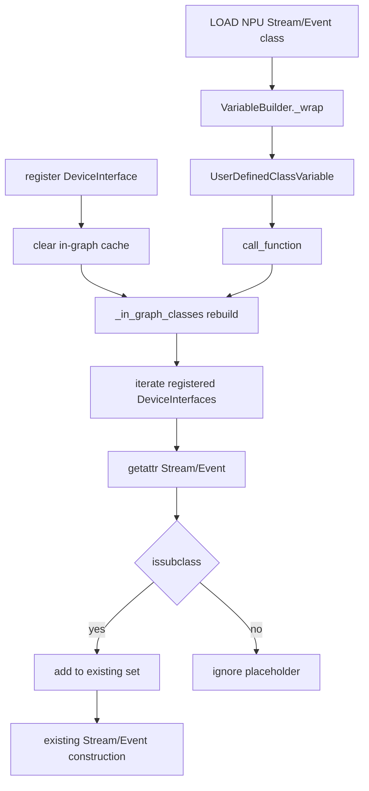

# torch_npu Monkey Patch 消除评审报告（2/4：Stream/Event 类）

> 依据 [`patch消除评审模板.md`](patch消除评审模板.md) 填写。本报告只评审
> `patch_user_defined_class_variable` 的 `_in_graph_classes` 子修改。
> `patch_stream_event_variable_python_type` 和 `patch_npu_stream_context` 仍保留，不属于本报告。

---

## 基本信息

| 项目 | 内容 |
|------|------|
| Patch 名称 | `patch_user_defined_class_variable` — Stream/Event `_in_graph_classes` 子修改 |
| 原始提交人 | 源码中未发现明确证据，待从原始 PR/Blame 补充 |
| 消除提交人 | 待提交时填写 |
| 提交日期 | 待提交时填写，不以运行环境日期代填 |
| 目标分支 | PyTorch detached HEAD `0c4461ed5d95`；torch_npu detached HEAD `741ee42ce188`，实际提交分支待填 |
| 相关 Issue | 源码和现有交付文档中未发现明确证据，待填 |
| 原始 PR | 源码中未发现明确证据，待填 |

---

## 1. Patch 消除概述

### 1.1 Patch 原始背景

PyTorch 的 `UserDefinedClassVariable._in_graph_classes()` 维护一组可在 Dynamo 图内特殊构造的类，
包含通用、CUDA、XPU 及可选 HPU 的 Stream/Event，但没有 NPU Stream/Event。
当 `torch.npu.Stream()` 或 `torch.npu.Event()` 被包装为普通 `UserDefinedClassVariable` 时，
`call_function()` 的图内类分支不命中，会继续尝试通用 Python 类构造路径。

原 patch 保存 `_in_graph_classes()` 旧方法，再在 torch_npu 侧全局替换它。
本节只保留说明集合缺口和 Patch 作用的最小片段，完整代码见 1.2、1.3 和 2.2。

代码框文件：`pytorch/torch/_dynamo/variables/user_defined.py`（upstream HEAD
`0c4461ed5d95`，原集合中的 Stream/Event 成员摘录）

```python
torch.Stream,
torch.Event,
torch.cuda.Stream,
torch.cuda.Event,
torch.xpu.Stream,
torch.xpu.Event,
```

上游集合没有 NPU 类，也没有读取已注册设备 interface。但 NPU interface
已经提供标准 `Stream` / `Event` 属性：

代码框文件：`torch_npu/torch_npu/utils/_dynamo_device.py`（torch_npu 基线
`741ee42ce188`，NPU 已实现的标准属性）

```python
class NpuInterface(DeviceInterface):
    device = torch.device
    Event = Event
    Stream = Stream
```

代码框文件：`torch_npu/torch_npu/utils/_dynamo.py`（torch_npu 基线
`741ee42ce188`，原 Patch 关键片段）

```python
@staticmethod
@functools.lru_cache(None)
def patched_in_graph_classes():
    result = original_method()
    result.add(torch.npu.Event)
    result.add(torch.npu.Stream)
    return result
```

代码框文件：`pytorch/torch/_dynamo/variables/user_defined.py`（upstream HEAD
`0c4461ed5d95`，决定能否进入既有 Stream/Event 构造逻辑的外层门禁）

```python
elif (
    self.value in self._in_graph_classes()
    or is_traceable_wrapper_subclass_type(self.value)
):
```

必须 patch 的原因是旧的 `UserDefinedClassVariable.call_function()` 只检查静态
`_in_graph_classes()`，没有消费已注册 `DeviceInterface` 中的 `Stream` / `Event`。
NPU 已在 `NpuInterface` 上实现这两个标准属性，但 Dynamo 该入口没有查询它们。

### 1.2 Patch 对应的社区代码

本节所有 `pytorch/` 代码均取自未应用候选修改的 upstream HEAD `0c4461ed5d95`；
候选修改后源码只在 2.2 展示。

| 代码来源 | 职责 |
| --- | --- |
| `pytorch/torch/_dynamo/variables/user_defined.py::UserDefinedClassVariable._in_graph_classes` | 上游图内类集合 |
| `pytorch/torch/_dynamo/variables/user_defined.py::UserDefinedClassVariable.call_function` | 图内 Stream/Event 构造、proxy 与 side effect 跟踪 |
| `pytorch/torch/_dynamo/device_interface.py::get_registered_device_interfaces` | 返回已注册的具体设备 interface |
| `torch_npu/torch_npu/utils/_dynamo_device.py::NpuInterface` | 已有 `Stream = Stream` 和 `Event = Event` |

NPU API 入口：

- `torch_npu/torch_npu/npu/streams.py::Stream`
- `torch_npu/torch_npu/npu/streams.py::Event`

代码框文件：评审用例（非仓库源码）

```python
@torch.compile(backend="eager", fullgraph=True)
def fn():
    stream = torch.npu.Stream(priority=0)
    event = torch.npu.Event(enable_timing=True)
    return stream, event
```

代码框文件：`pytorch/torch/_dynamo/device_interface.py`（upstream HEAD）

`DeviceInterface` 中 Stream/Event 接口契约的完整源码：

```python
class Event:
    def __new__(cls, *args: Any, **kwargs: Any) -> Any:
        raise NotImplementedError(
            "Event should be inherited from torch.Event, otherwise, it couldn't be captured by dynamo."
        )


class Stream:
    def __new__(cls, *args: Any, **kwargs: Any) -> Any:
        raise NotImplementedError(
            "Stream should be inherited from torch.Stream, otherwise, it couldn't be captured by dynamo."
        )
```

代码框文件：`pytorch/torch/_dynamo/device_interface.py`（upstream HEAD）

注册与查询接口的完整源码：

```python
device_interfaces: dict[str, type[DeviceInterface]] = {}
_device_initialized = False


def register_interface_for_device(
    device: str | torch.device, device_interface: type[DeviceInterface]
) -> None:
    if isinstance(device, torch.device):
        device = device.type
    device_interfaces[device] = device_interface


def get_registered_device_interfaces() -> Iterable[tuple[str, type[DeviceInterface]]]:
    if not _device_initialized:
        init_device_reg()
    return device_interfaces.items()
```

代码框文件：`torch_npu/torch_npu/utils/_dynamo_device.py`（torch_npu 基线）

`NpuInterface` 已有属性源码：

```python
class NpuInterface(DeviceInterface):
    device = torch.device
    Event = Event
    Stream = Stream
```

代码框文件：`pytorch/torch/_dynamo/variables/user_defined.py`（upstream HEAD）

`UserDefinedClassVariable._in_graph_classes()` 原始完整源码：

```python
@staticmethod
@functools.cache
def _in_graph_classes() -> set[type[object]]:
    _in_graph_class_list = {
        torch.Tensor,
        torch.cuda.FloatTensor,  # type: ignore[attr-defined]
        torch.cuda.DoubleTensor,  # type: ignore[attr-defined]
        torch.cuda.HalfTensor,  # type: ignore[attr-defined]
        torch.cuda.BFloat16Tensor,  # type: ignore[attr-defined]
        torch.cuda.ByteTensor,  # type: ignore[attr-defined]
        torch.cuda.CharTensor,  # type: ignore[attr-defined]
        torch.cuda.IntTensor,  # type: ignore[attr-defined]
        torch.cuda.ShortTensor,  # type: ignore[attr-defined]
        torch.cuda.LongTensor,  # type: ignore[attr-defined]
        torch.Stream,
        torch.Event,
        torch.cuda.Stream,
        torch.cuda.Event,
        torch.xpu.Stream,
        torch.xpu.Event,
    }
    if hasattr(torch, "hpu"):
        _in_graph_class_list.update(
            {
                torch.hpu.Stream,
                torch.hpu.Event,
            }
        )

    return set(tensortype_to_dtype.keys()) | _in_graph_class_list
```

代码框文件：`pytorch/torch/_dynamo/variables/user_defined.py`（upstream HEAD）

`UserDefinedClassVariable.call_function()` 中从外层 `elif` 到 `return` 的完整源码：

```python
elif (
    self.value in self._in_graph_classes()
    or is_traceable_wrapper_subclass_type(self.value)
):
    # torch.LongTensor cannot accept a list of FakeTensors.
    # So we stack the list of FakeTensors instead.
    from .lists import ListVariable

    if (
        np
        and self.value in tensortype_to_dtype
        and len(args) == 1
        and isinstance(args[0], ListVariable)
        and len(args[0].items) > 1
        and all(x.is_tensor() for x in args[0].items)
    ):
        # Stack FakeTensor
        stacked = wrap_fx_proxy(
            tx=tx,
            proxy=tx.output.create_proxy(
                "call_function",
                torch.stack,
                *proxy_args_kwargs(args, kwargs),
            ),
        )
        args = [stacked]

    if issubclass(self.value, torch.Stream):
        from .lists import TupleVariable

        var_kwargs = ConstDictVariable(
            {VariableTracker.build(tx, k): v for k, v in kwargs.items()}
        )
        var_args = TupleVariable(list(args))
        stream = self.value(
            *(var_args.as_python_constant()),
            **(var_kwargs.as_python_constant()),
        )
        from ..graph_bytecode_inputs import register_graph_created_object
        from .streams import StreamVariable

        ind = register_graph_created_object(
            stream,
            StreamVariable.make_construct_in_graph_stream_fn(
                var_args, var_kwargs
            ),
        )
        tensor_variable = wrap_fx_proxy(
            tx=tx,
            proxy=tx.output.create_proxy(
                "call_function", get_external_object_by_index, (ind,), {}
            ),
        )
    elif issubclass(self.value, torch.Event):
        from .lists import TupleVariable

        # Register newly created event for reconstruction
        var_kwargs = ConstDictVariable(
            {VariableTracker.build(tx, k): v for k, v in kwargs.items()}
        )
        var_args = TupleVariable(list(args))
        event = self.value(
            *(var_args.as_python_constant()),
            **(var_kwargs.as_python_constant()),
        )
        from ..graph_bytecode_inputs import register_graph_created_object
        from .streams import EventVariable

        ind = register_graph_created_object(
            event,
            EventVariable.make_construct_in_graph_event_fn(
                var_args, var_kwargs
            ),
        )
        tensor_variable = wrap_fx_proxy(
            tx=tx,
            proxy=tx.output.create_proxy(
                "call_function", get_external_object_by_index, (ind,), {}
            ),
        )
    else:
        tensor_variable = wrap_fx_proxy(
            tx=tx,
            proxy=tx.output.create_proxy(
                "call_function",
                self.value,
                *proxy_args_kwargs(args, kwargs),
            ),
        )

    return tensor_variable
```

### 1.3 Patch 代码描述

修改前 `torch_npu/torch_npu/utils/_dynamo.py::patch_user_defined_class_variable`
完整源码如下；本报告关注其中 `patched_in_graph_classes()`，其余两条分支分别由报告 3、4 评审：

代码框文件：`torch_npu/torch_npu/utils/_dynamo.py`（torch_npu 基线、原 Patch）

```python
def patch_user_defined_class_variable():
    import functools
    from torch._dynamo.variables.user_defined import UserDefinedClassVariable
    from torch._dynamo.variables.torch import TorchCtxManagerClassVariable
    from torch._dynamo.variables.torch import TorchInGraphFunctionVariable
    original_method = UserDefinedClassVariable._in_graph_classes

    class NPUTorchCtxManagerClassVariable(TorchCtxManagerClassVariable):
        def call_function(self, tx, args, kwargs):
            return _create_npu_autocast_mode_variable(self.value, args, kwargs)

    @staticmethod
    @functools.lru_cache(None)
    def patched_in_graph_classes():
        result = original_method()
        result.add(torch.npu.Event)
        result.add(torch.npu.Stream)
        return result

    def UserDefinedClassVariable__new__(cls, value, **kwargs):
        if value in [
            torch.npu.amp.autocast,
            torch_npu.npu.amp.autocast,
            torch.npu.amp.autocast_mode.autocast,
            torch_npu.npu.amp.autocast_mode.autocast,
        ]:
            return NPUTorchCtxManagerClassVariable(value, **kwargs)
        elif value in [
            torch_npu.npu.BoolTensor,
            torch_npu.npu.ByteTensor,
            torch_npu.npu.CharTensor,
            torch_npu.npu.DoubleTensor,
            torch_npu.npu.FloatTensor,
            torch_npu.npu.HalfTensor,
            torch_npu.npu.IntTensor,
            torch_npu.npu.LongTensor,
            torch_npu.npu.ShortTensor,
            torch_npu.npu.BFloat16Tensor,
        ]:
            return TorchInGraphFunctionVariable(value, **kwargs)
        return cls.__new__raw(cls)

    UserDefinedClassVariable._in_graph_classes = patched_in_graph_classes
    UserDefinedClassVariable.__new__raw = UserDefinedClassVariable.__new__
    UserDefinedClassVariable.__new__ = UserDefinedClassVariable__new__
```

修改前安装入口完整源码：

代码框文件：`torch_npu/torch_npu/utils/_dynamo.py`（torch_npu 基线、原 Patch）

```python
@run_once
def add_dynamo_methods_init():
    _dynamo_register_interface_for_device()
    patch_SkipFunctionVariable()
    patch_TensorVariable_call_method()
    patch_user_defined_class_variable()
    patch_stream_event_variable_python_type()
    patch_npu_stream_context()
```

该代码对所有 `UserDefinedClassVariable` 实例替换静态方法，不能把影响限定在 NPU 路由对象上。

---

## 2. 消除方案

### 2.1 消除方式

- [ ] **直接删除** - 移除全部 Patch 代码，无需替换
- [x] **替换为社区标准方式** - 在 Dynamo 现有图内类入口读取已注册 `DeviceInterface`
- [ ] **降级为条件 Patch** - 保留 Patch 但增加版本条件判断
- [ ] **其他**

PyTorch 在 `UserDefinedClassVariable._in_graph_classes()` 中遍历已注册 interface，
用 `getattr(device_interface, "Stream"/"Event", ())` 取得实现类并加入现有集合。
torch_npu 不再维护 Stream/Event 类名表或专用 VariableTracker。

### 2.2 总体方案

#### 文件一：`pytorch/torch/_dynamo/variables/user_defined.py`

候选工作树中的完整 `_in_graph_classes()` 如下。该函数同时包含报告 4 的 PrivateUse1
Tensor 收集逻辑；本报告负责的 Stream/Event 逻辑位于后半段，遍历具体 interface 并分别
读取、验证 `Stream` 和 `Event`。

代码框文件：`pytorch/torch/_dynamo/variables/user_defined.py`（候选工作树，完整函数）

```python
@staticmethod
@functools.cache
def _in_graph_classes() -> set[type[object]]:
    _in_graph_class_list = {
        torch.Tensor,
        torch.cuda.FloatTensor,  # type: ignore[attr-defined]
        torch.cuda.DoubleTensor,  # type: ignore[attr-defined]
        torch.cuda.HalfTensor,  # type: ignore[attr-defined]
        torch.cuda.BFloat16Tensor,  # type: ignore[attr-defined]
        torch.cuda.ByteTensor,  # type: ignore[attr-defined]
        torch.cuda.CharTensor,  # type: ignore[attr-defined]
        torch.cuda.IntTensor,  # type: ignore[attr-defined]
        torch.cuda.ShortTensor,  # type: ignore[attr-defined]
        torch.cuda.LongTensor,  # type: ignore[attr-defined]
        torch.Stream,
        torch.Event,
        torch.cuda.Stream,
        torch.cuda.Event,
        torch.xpu.Stream,
        torch.xpu.Event,
    }
    if hasattr(torch, "hpu"):
        _in_graph_class_list.update(
            {
                torch.hpu.Stream,
                torch.hpu.Event,
            }
        )

    privateuse1_module = getattr(
        torch, torch._C._get_privateuse1_backend_name(), None
    )
    if privateuse1_module is not None:
        for tensor_type in tensortype_to_dtype:
            privateuse1_tensor_type = getattr(
                privateuse1_module, tensor_type.__name__, None
            )
            if (
                isinstance(privateuse1_tensor_type, type)
                and privateuse1_tensor_type in torch._tensor_classes
            ):
                _in_graph_class_list.add(privateuse1_tensor_type)

    for _, device_interface in get_registered_device_interfaces():
        stream_class = getattr(device_interface, "Stream", ())
        if isinstance(stream_class, type) and issubclass(
            stream_class, torch.Stream
        ):
            _in_graph_class_list.add(stream_class)

        event_class = getattr(device_interface, "Event", ())
        if isinstance(event_class, type) and issubclass(event_class, torch.Event):
            _in_graph_class_list.add(event_class)

    return set(tensortype_to_dtype.keys()) | _in_graph_class_list
```

本文件中属于 Stream/Event 子任务的完整关键 diff 为：

代码框文件：`pytorch/torch/_dynamo/variables/user_defined.py`（upstream HEAD → 候选工作树）

```diff
 from ..create_parameter_op import do_not_convert_to_tracable_parameter
+from ..device_interface import get_registered_device_interfaces

 @staticmethod
 @functools.cache
 def _in_graph_classes() -> set[type[object]]:
     _in_graph_class_list = {
         torch.Tensor,
         torch.cuda.FloatTensor,
         torch.cuda.DoubleTensor,
         torch.cuda.HalfTensor,
         torch.cuda.BFloat16Tensor,
         torch.cuda.ByteTensor,
         torch.cuda.CharTensor,
         torch.cuda.IntTensor,
         torch.cuda.ShortTensor,
         torch.cuda.LongTensor,
         torch.Stream,
         torch.Event,
         torch.cuda.Stream,
         torch.cuda.Event,
         torch.xpu.Stream,
         torch.xpu.Event,
     }
     if hasattr(torch, "hpu"):
         _in_graph_class_list.update(
             {
                 torch.hpu.Stream,
                 torch.hpu.Event,
             }
         )
+
+    for _, device_interface in get_registered_device_interfaces():
+        stream_class = getattr(device_interface, "Stream", ())
+        if isinstance(stream_class, type) and issubclass(
+            stream_class, torch.Stream
+        ):
+            _in_graph_class_list.add(stream_class)
+
+        event_class = getattr(device_interface, "Event", ())
+        if isinstance(event_class, type) and issubclass(event_class, torch.Event):
+            _in_graph_class_list.add(event_class)

     return set(tensortype_to_dtype.keys()) | _in_graph_class_list
```

说明：上面的候选源码框展示合并后的完整函数；diff 框只突出本报告所属的 import 和
Stream/Event 新增逻辑，没有用省略号代替该逻辑。

#### 文件二：`pytorch/torch/_dynamo/device_interface.py`

总体方案源码：

代码框文件：`pytorch/torch/_dynamo/device_interface.py`（候选工作树）

```python
def register_interface_for_device(
    device: str | torch.device, device_interface: type[DeviceInterface]
) -> None:
    if isinstance(device, torch.device):
        device = device.type
    device_interfaces[device] = device_interface
    from .variables.user_defined import UserDefinedClassVariable

    UserDefinedClassVariable._in_graph_classes.cache_clear()
```

本文件的完整关键 diff：

代码框文件：`pytorch/torch/_dynamo/device_interface.py`（upstream HEAD → 候选工作树）

```diff
 def register_interface_for_device(
     device: str | torch.device, device_interface: type[DeviceInterface]
 ) -> None:
     if isinstance(device, torch.device):
         device = device.type
     device_interfaces[device] = device_interface
+    from .variables.user_defined import UserDefinedClassVariable
+
+    UserDefinedClassVariable._in_graph_classes.cache_clear()
```

#### 文件三：`torch_npu/utils/_dynamo.py`

消除 patch 后的完整初始化入口：

代码框文件：`torch_npu/torch_npu/utils/_dynamo.py`（候选工作树）

```python
@run_once
def add_dynamo_methods_init():
    _dynamo_register_interface_for_device()
    patch_TensorVariable_call_method()
    patch_stream_event_variable_python_type()
    patch_npu_stream_context()
```

本文件与 Stream/Event 子任务对应的完整关键 diff：

代码框文件：`torch_npu/torch_npu/utils/_dynamo.py`（torch_npu 基线 → 候选工作树）

```diff
-    @staticmethod
-    @functools.lru_cache(None)
-    def patched_in_graph_classes():
-        result = original_method()
-        result.add(torch.npu.Event)
-        result.add(torch.npu.Stream)
-        return result
-
-    UserDefinedClassVariable._in_graph_classes = patched_in_graph_classes

 @run_once
 def add_dynamo_methods_init():
     _dynamo_register_interface_for_device()
     patch_TensorVariable_call_method()
-    patch_user_defined_class_variable()
     patch_stream_event_variable_python_type()
     patch_npu_stream_context()
```

#### 为什么不直接查 `DeviceInterface.Event`

代码框文件：方案表达式，目标位置为 `pytorch/torch/_dynamo/variables/user_defined.py`

```python
getattr(DeviceInterface, "Event", ())
```

上式取到的是基类占位符，不是 `NpuInterface.Event`。因此必须对
`get_registered_device_interfaces()` 返回的具体 interface 调用 `getattr`。
由于未实现流/事件的 interface 会继承基类占位符，还需用 `issubclass`
保证命中者是真实 `torch.Stream` / `torch.Event` 子类。

#### 有 patch 时的路由（含源码）

patch 安装后，原社区集合先构建，再原地加入 NPU 类：

代码框文件：`torch_npu/torch_npu/utils/_dynamo.py`（torch_npu 基线、原 Patch）

```python
@staticmethod
@functools.lru_cache(None)
def patched_in_graph_classes():
    result = original_method()
    result.add(torch.npu.Event)
    result.add(torch.npu.Stream)
    return result


UserDefinedClassVariable._in_graph_classes = patched_in_graph_classes
```

CALL 阶段通过 1.2 已完整展示的社区 Stream/Event 构造源码命中；patch 只改变
`_in_graph_classes()` 的返回集合，不改变构造、对象登记或 FX proxy 逻辑。

代码框类型：路由示意（非仓库源码）

```text
LOAD NPU Stream/Event → UserDefinedClassVariable
→ patched_in_graph_classes 强制加入 NPU 类
→ call_function 的 Stream/Event 分支
```

#### 消除 patch 后的路由（含源码）

NPU 初始化先注册具体 interface：

代码框文件：`torch_npu/torch_npu/utils/_dynamo.py`（候选工作树）

```python
@run_once
def _dynamo_register_interface_for_device():
    from torch._dynamo.device_interface import register_interface_for_device
    from torch_npu.utils._dynamo_device import NpuInterface

    register_interface_for_device("npu", NpuInterface)
    for i in range(32):
        register_interface_for_device(f"npu:{i}", NpuInterface)
```

社区集合从注册表读取真实实现类：

代码框文件：`pytorch/torch/_dynamo/variables/user_defined.py`（候选工作树）

```python
for _, device_interface in get_registered_device_interfaces():
    stream_class = getattr(device_interface, "Stream", ())
    if isinstance(stream_class, type) and issubclass(
        stream_class, torch.Stream
    ):
        _in_graph_class_list.add(stream_class)

    event_class = getattr(device_interface, "Event", ())
    if isinstance(event_class, type) and issubclass(event_class, torch.Event):
        _in_graph_class_list.add(event_class)
```

代码框类型：路由示意（非仓库源码）

```text
register NpuInterface → cache_clear
→ LOAD NPU Stream/Event → UserDefinedClassVariable
→ _in_graph_classes 遍历注册表并 getattr 真实类
→ call_function 的同一 Stream/Event 分支
```

#### 完整调用链

1. `register_interface_for_device()` 登记后端并清理旧缓存。
2. LOAD 指令取得 `torch.npu.Stream`/`Event` 类对象。
3. `VariableBuilder._wrap` 按原有路径构造 `UserDefinedClassVariable`。
4. CALL 指令进入 `UserDefinedClassVariable.call_function()`。
5. `_in_graph_classes()` 重建时遍历全部已注册 interface。
6. `getattr(NpuInterface, "Stream"/"Event", ())` 取得具体实现类并加入集合。
7. CALL 阶段通过 `self.value in self._in_graph_classes()` 命中上游现有 Stream/Event 构造、proxy 和 side-effect 登记。

代码框类型：调用链示意（非仓库源码）



#### 影响范围与限制

- `DeviceInterface` 基类和 `NpuInterface` 无新槽位或 `_dynamo_*` 元数据；
  `device_interface.py` 只在既有注册函数中增加缓存失效。
- 只有 interface 已注册且实现类继承标准基类时才会加入集合。
- 不依赖完整名称，因此同一 Stream/Event 类的公开别名自然共享路由。
- 收集结果进入 `_in_graph_classes()` 的既有缓存；后续注册会主动失效缓存，晚注册接口同样生效。
- Python type 和 stream context enter/exit 由范围外 patch 继续提供，本报告不宣称替代。
- 整个 `patch_user_defined_class_variable` 只能在本报告与 autocast、Tensor 两份报告都成立后删除。

### 2.3 技术选型（可选）

| 方案 | 优点 | 缺点 | 结论 |
| --- | --- | --- | --- |
| 全局 patch `_in_graph_classes` | 实现简单 | 改变所有 `UserDefinedClassVariable` 的类集合 | 不选 |
| `_in_graph_classes()` 收集 + 注册侧 `cache_clear()` | 复用现有 XPU 控制点，支持晚注册，热路径保持缓存 | 注册函数与缓存存在明确联动 | **采用** |
| 在 `call_function()` 现场动态判断 | 支持晚注册 | 新增第二条判断路径 | 不选 |
| `NpuInterface` 私有元数据 | PyTorch 改动少 | 形成未公开的后端合约 | 不选 |
| PyTorch 中 NPU `if/else` | 隔离清晰 | 上游不应导入 torch_npu 类 | 备选 |
| 精确类白名单 + NPU 子类 | 只影响列名对象 | 为已有 DeviceInterface 能力新建重复机制 | 不选 |

---

## 附录：PR 提交功能验证参考

### A.1 测试覆盖

| 测试类型 | 是否执行 | 测试结果 | 说明 |
|----------|---------|---------|------|
| 单元测试 | ☑ 是 ☐ 否 | ☑ 通过 ☐ 未通过 | `test_registered_device_stream_event_in_graph_classes`：1 passed |
| 集成测试 | ☑ 是 ☐ 否 | ☑ 通过 ☐ 未通过 | 当前 21 项子集中 Stream/Event 两态均 4 pass |
| 回归测试 | ☑ 是 ☐ 否 | ☐ 通过 ☑ 未通过 | 当前 21 项两态均 20 pass / 1 error，失败 identity/签名一致 |
| 精度对比测试 | ☐ 是 ☑ 否 | ☐ 通过 ☑ 未通过 | 当前 NPU 环境不可用 |
| 性能对比测试 | ☐ 是 ☑ 否 | ☐ 通过 ☑ 未通过 | 未执行 |

### A.2 测试环境

| 项目 | 内容 |
|------|------|
| PyTorch 版本 | `2.14.0.dev20260805+cpu` (`f012e05e1018`) |
| torch_npu 版本 | `2.14.0+git06101a0` (`06101a0ec0be`) |
| CANN 版本 | `9.0.0`，来自 `/usr/local/Ascend/ascend-toolkit/latest/compiler/version.info` |
| 硬件型号 | 当前沙箱 `npu-smi info` 无法返回型号；源码中未发现明确证据 |

### A.3 测试结果说明

当前 21 项日志：`/home/z50063656/tmp/dynamo-privateuse1-tensor-getattr-{baseline,candidate}.log`，状态哈希为同名 `.sha256`。

- `TestInGraphClasses` 两态均为 4 pass；晚注册 PyTorch 单测 1 passed。
- 全套唯一错误是 `TestTensorTypes.test_all_tensor_types_construct` 的 recompile limit，
  与 Stream/Event 无关且两态签名一致。
