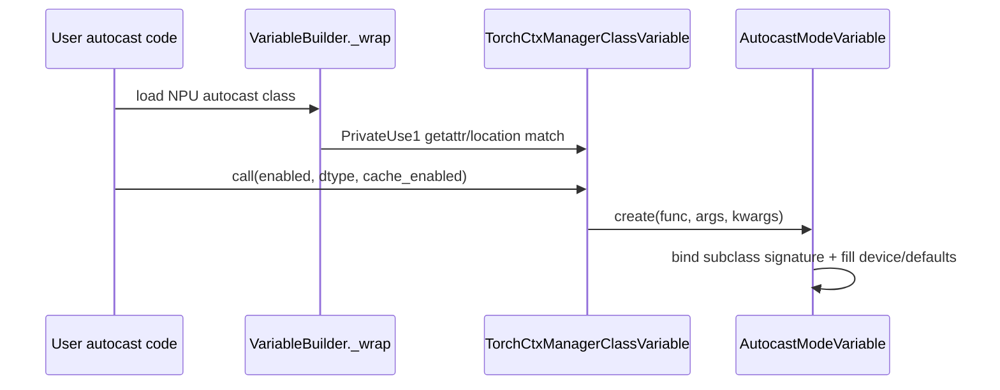

# torch_npu Monkey Patch 消除评审报告（3/4：NPU autocast）

> 依据 [`patch消除评审模板.md`](patch消除评审模板.md) 填写。本报告只评审
> `patch_user_defined_class_variable` 的 autocast `__new__` 拦截与专用 helper。

---

## 基本信息

| 项目 | 内容 |
|------|------|
| Patch 名称 | `patch_user_defined_class_variable` — NPU autocast 子修改；`_create_npu_autocast_mode_variable` |
| 原始提交人 | 源码中未发现明确证据，待从原始 PR/Blame 补充 |
| 消除提交人 | 待提交时填写 |
| 提交日期 | 待提交时填写，不以运行环境日期代填 |
| 目标分支 | PyTorch detached HEAD `0c4461ed5d95`；torch_npu detached HEAD `741ee42ce188`，实际提交分支待填 |
| 相关 Issue | 源码和现有交付文档中未发现明确证据，待填 |
| 原始 PR | 源码中未发现明确证据，待填 |

---

## 1. Patch 消除概述

### 1.1 Patch 原始背景

`torch_npu.npu.amp.autocast` 继承 `torch.amp.autocast_mode.autocast`，但其公开构造签名仅为
`enabled`、`dtype`、`cache_enabled`，在 `__init__` 内部把 `"npu"` 传给父类。
PyTorch Dynamo 原生 autocast 路由只接受通用、CUDA 和 CPU autocast 类。
本节只保留两层门禁和原 Patch 拦截所需的代码，完整代码见 1.2、1.3 和 2.2。

代码框文件：`torch_npu/torch_npu/npu/amp/autocast_mode.py`（torch_npu 基线
`741ee42ce188`，NPU 子类签名及父类调用片段）

```python
def __init__(self, enabled: bool = True, dtype: torch.dtype = torch.float16, cache_enabled: bool = True):
    super().__init__("npu", enabled=enabled, dtype=dtype, cache_enabled=cache_enabled)
```

这里可以直接看到 NPU 子类签名没有 `device_type`，而是把 `"npu"` 固定传给父类。

代码框文件：`pytorch/torch/_dynamo/variables/torch.py`（upstream HEAD
`0c4461ed5d95`，原表中的 autocast 成员摘录）

```python
torch.amp.autocast_mode.autocast,
torch.cpu.amp.autocast_mode.autocast,
torch.cuda.amp.autocast_mode.autocast,
```

匹配阶段只认该表中的对象：

代码框文件：`pytorch/torch/_dynamo/variables/torch.py`（upstream HEAD
`0c4461ed5d95`，ctx-manager 匹配关键条件）

```python
return callable(value) and hashable(value) and value in supported_ctx_manager_classes
```

代码框文件：`pytorch/torch/_dynamo/variables/torch.py`（upstream HEAD
`0c4461ed5d95`，原始 autocast 调用门禁）

```python
elif self.value in (
    torch.amp.autocast_mode.autocast,
    torch.cuda.amp.autocast,
    torch.cpu.amp.autocast,
):
    # pyrefly: ignore [bad-argument-type]
    return AutocastModeVariable.create(self.value, args, kwargs)
```

即使类对象被送到 `AutocastModeVariable.create()`，函数内部仍只接受三类
autocast，且 NPU 子类签名里没有 `device_type`：

代码框文件：`pytorch/torch/_dynamo/variables/ctx_manager.py`（upstream HEAD
`0c4461ed5d95`，原生参数处理关键片段）

```python
if func not in [
    torch.amp.autocast_mode.autocast,
    torch.cuda.amp.autocast,
    torch.cpu.amp.autocast,
]:
    raise AssertionError(f"unexpected autocast function: {func}")

for key in ["device_type", "dtype", "enabled", "cache_enabled"]:
    if key == "device_type" and func in [torch.cuda.amp.autocast, torch.cpu.amp.autocast]:
        arg = "cuda" if func is torch.cuda.amp.autocast else "cpu"
    else:
        arg = bound_args.arguments[key]
```

原 Patch 在 torch_npu 侧重写参数组装，为 NPU 补出 `device_type="npu"`：

代码框文件：`torch_npu/torch_npu/utils/_dynamo.py`（torch_npu 基线
`741ee42ce188`，原 Patch 关键参数分支）

```python
if key == "device_type" and func is torch_npu.npu.amp.autocast:
    arg = "npu"
else:
    arg = bound_args.arguments[key]
```

代码框文件：`torch_npu/torch_npu/utils/_dynamo.py`（torch_npu 基线
`741ee42ce188`，原 Patch 的专用 VariableTracker 连续源码段）

```python
class NPUTorchCtxManagerClassVariable(TorchCtxManagerClassVariable):
    def call_function(self, tx, args, kwargs):
        return _create_npu_autocast_mode_variable(self.value, args, kwargs)
```

代码框文件：`torch_npu/torch_npu/utils/_dynamo.py`（torch_npu 基线
`741ee42ce188`，原 Patch 的对象拦截连续源码段）

```python
def UserDefinedClassVariable__new__(cls, value, **kwargs):
    if value in [
        torch.npu.amp.autocast,
        torch_npu.npu.amp.autocast,
        torch.npu.amp.autocast_mode.autocast,
        torch_npu.npu.amp.autocast_mode.autocast,
    ]:
        return NPUTorchCtxManagerClassVariable(value, **kwargs)
```

NPU autocast 类对象因此落入 `UserDefinedClassVariable`。原 patch 替换
`UserDefinedClassVariable.__new__`，对四个 NPU autocast 导入路径返回内嵌的
`NPUTorchCtxManagerClassVariable`；该类的 `call_function()` 调用 helper，显式生成
`["npu", dtype, enabled, cache_enabled]`。

原 patch 必须同时解决两层问题：

1. 类对象在 Builder 阶段不能被选为 ctx-manager VariableTracker。
2. 即使选中上游 `TorchCtxManagerClassVariable`，其 autocast identity 分支和
   `AutocastModeVariable.create()` 也不接受 NPU autocast 类。

### 1.2 Patch 对应的社区代码

本节所有 `pytorch/` 代码均取自未应用候选修改的 upstream HEAD `0c4461ed5d95`；
PrivateUse1 helper 属于候选新增代码，只在 2.2 展示。

| 社区代码 | 职责 |
| --- | --- |
| `pytorch/torch/_dynamo/variables/builder.py::VariableBuilder._wrap` | 类对象 VariableTracker 选择 |
| `pytorch/torch/_dynamo/variables/torch.py::TorchCtxManagerClassVariable` | 社区 ctx-manager 类包装与调用分流 |
| `pytorch/torch/_dynamo/variables/ctx_manager.py::AutocastModeVariable` | autocast enter/exit 象征状态 |
| `pytorch/torch/_dynamo/variables/ctx_manager.py::AutocastModeVariable.create` | 原生通用、CUDA、CPU autocast 参数绑定 |

NPU 公开 API：

- `torch_npu/torch_npu/npu/amp/autocast_mode.py::autocast`
- `torch.npu.amp.autocast`
- `torch_npu.npu.amp.autocast`

代码框文件：评审用例（非仓库源码）

```python
@torch.compile(backend="eager", fullgraph=True)
def fn(x):
    with torch.npu.amp.autocast(enabled=True, dtype=torch.float16):
        return torch.mm(x, x.T)
```

参数：`enabled` 控制 autocast 开关，`dtype` 指定 NPU autocast dtype，`cache_enabled` 控制
autocast 权重缓存。`device_type` 不是 NPU 子类的公开入参。

代码框文件：`torch_npu/torch_npu/npu/amp/autocast_mode.py`（torch_npu 基线）

`autocast` 完整类源码：

```python
class autocast(torch.amp.autocast_mode.autocast):
    r"""
    See :class:`torch.autocast`.
    ``torch.npu.amp.autocast(args...)`` is equivalent to ``torch.autocast("npu", args...)``
    """

    def __init__(self, enabled: bool = True, dtype: torch.dtype = torch.float16, cache_enabled: bool = True):
        if torch._jit_internal.is_scripting():
            self._enabled = enabled
            self.device = "npu"
            self.fast_dtype = dtype
            return
        super().__init__("npu", enabled=enabled, dtype=dtype, cache_enabled=cache_enabled)

    def __enter__(self):
        if torch._jit_internal.is_scripting():
            return self
        return super().__enter__()

    def __exit__(self, exc_type: Any, exc_val: Any, exc_tb: Any):  # type: ignore[override]
        if torch._jit_internal.is_scripting():
            return None
        return super().__exit__(exc_type, exc_val, exc_tb)

    def __call__(self, func):
        if torch._jit_internal.is_scripting():
            return func
        return super().__call__(func)
```

代码框文件：`pytorch/torch/_dynamo/variables/builder.py`（upstream HEAD）

`VariableBuilder._wrap` 的完整 ctx-manager 选路分支：

```python
elif TorchCtxManagerClassVariable.is_matching_cls(value):
    if inspect.isclass(value):
        self.install_guards(GuardBuilder.CLASS_MATCH)
    elif inspect.isfunction(value):
        self.install_guards(GuardBuilder.CLOSURE_MATCH)
    return TorchCtxManagerClassVariable(value, source=self.source)
```

代码框文件：`pytorch/torch/_dynamo/variables/torch.py`（upstream HEAD）

`TorchCtxManagerClassVariable.is_matching_cls()` 原始完整源码：

```python
@staticmethod
def is_matching_cls(value: Any) -> bool:
    # Unwrap if it's a functools.lru_cache wrapper
    value = unwrap_if_wrapper(value)
    # We can't do isinstance(value, type) check because some ctx managers
    # are implemented as a function decorated by contextlib.contextmanager,
    # E.g., torch._functorch.vmap.vmap_increment_nesting.
    return (
        # Context manager type or function with @contextmanager is callable
        callable(value)
        and (
            hashable(value)  # accesses value.__hash__()
            and value in supported_ctx_manager_classes
        )
    )
```

代码框文件：`pytorch/torch/_dynamo/variables/torch.py`（upstream HEAD）

`TorchCtxManagerClassVariable.call_function()` 中原始 autocast 完整分支：

```python
elif self.value in (
    torch.amp.autocast_mode.autocast,
    torch.cuda.amp.autocast,
    torch.cpu.amp.autocast,
):
    # pyrefly: ignore [bad-argument-type]
    return AutocastModeVariable.create(self.value, args, kwargs)
```

代码框文件：`pytorch/torch/_dynamo/variables/ctx_manager.py`（upstream HEAD）

`AutocastModeVariable.create()` 原始完整源码：

```python
@staticmethod
def create(
    func: torch.amp.autocast_mode.autocast,
    args: Sequence[Any],
    kwargs: dict[str, Any],
) -> "AutocastModeVariable":
    if func not in [
        torch.amp.autocast_mode.autocast,
        torch.cuda.amp.autocast,
        torch.cpu.amp.autocast,
    ]:
        raise AssertionError(f"unexpected autocast function: {func}")
    # device_type : str,
    # dtype : Optional[_dtype] = None,
    # enabled : bool = True,
    # cache_enabled : Optional[bool] = None):cache_enabled
    bound_args = inspect.signature(func).bind(*args, **kwargs)
    bound_args.apply_defaults()
    target_values = []
    kwargs.clear()

    for key in ["device_type", "dtype", "enabled", "cache_enabled"]:
        if key == "device_type" and func in [
            torch.cuda.amp.autocast,
            torch.cpu.amp.autocast,
        ]:
            # pyrefly: ignore [unnecessary-comparison]
            arg = "cuda" if func is torch.cuda.amp.autocast else "cpu"
        else:
            arg = bound_args.arguments[key]
        if isinstance(arg, VariableTracker):
            target_values.append(arg.as_python_constant())
        else:
            target_values.append(arg)

    var = AutocastModeVariable(target_values, initial_values=None, **kwargs)
    return var
```

### 1.3 Patch 代码描述

修改前 `_create_npu_autocast_mode_variable()` 与
`patch_user_defined_class_variable()` 的完整源码：

代码框文件：`torch_npu/torch_npu/utils/_dynamo.py`（torch_npu 基线、原 Patch）

```python
def _create_npu_autocast_mode_variable(func, args, kwargs):
    from torch._dynamo.variables.ctx_manager import AutocastModeVariable
    from torch._dynamo.variables.base import VariableTracker
    bound_args = inspect.signature(func).bind(*args, **kwargs)
    bound_args.apply_defaults()
    target_values = []
    kwargs.clear()

    for key in ["device_type", "dtype", "enabled", "cache_enabled"]:
        if key == "device_type" and func in [torch_npu.npu.amp.autocast]:
            arg = "npu"
        else:
            arg = bound_args.arguments[key]
        if isinstance(arg, VariableTracker):
            target_values.append(arg.as_python_constant())
        else:
            target_values.append(arg)

    var = AutocastModeVariable(target_values, initial_values=None, **kwargs)
    return var


def patch_user_defined_class_variable():
    import functools
    from torch._dynamo.variables.user_defined import UserDefinedClassVariable
    from torch._dynamo.variables.torch import TorchCtxManagerClassVariable
    from torch._dynamo.variables.torch import TorchInGraphFunctionVariable
    original_method = UserDefinedClassVariable._in_graph_classes

    class NPUTorchCtxManagerClassVariable(TorchCtxManagerClassVariable):
        def call_function(self, tx, args, kwargs):
            return _create_npu_autocast_mode_variable(self.value, args, kwargs)

    @staticmethod
    @functools.lru_cache(None)
    def patched_in_graph_classes():
        result = original_method()
        result.add(torch.npu.Event)
        result.add(torch.npu.Stream)
        return result

    def UserDefinedClassVariable__new__(cls, value, **kwargs):
        if value in [
            torch.npu.amp.autocast,
            torch_npu.npu.amp.autocast,
            torch.npu.amp.autocast_mode.autocast,
            torch_npu.npu.amp.autocast_mode.autocast,
        ]:
            return NPUTorchCtxManagerClassVariable(value, **kwargs)
        elif value in [
            torch_npu.npu.BoolTensor,
            torch_npu.npu.ByteTensor,
            torch_npu.npu.CharTensor,
            torch_npu.npu.DoubleTensor,
            torch_npu.npu.FloatTensor,
            torch_npu.npu.HalfTensor,
            torch_npu.npu.IntTensor,
            torch_npu.npu.LongTensor,
            torch_npu.npu.ShortTensor,
            torch_npu.npu.BFloat16Tensor,
        ]:
            return TorchInGraphFunctionVariable(value, **kwargs)
        return cls.__new__raw(cls)

    UserDefinedClassVariable._in_graph_classes = patched_in_graph_classes
    UserDefinedClassVariable.__new__raw = UserDefinedClassVariable.__new__
    UserDefinedClassVariable.__new__ = UserDefinedClassVariable__new__
```

修改前安装入口完整源码：

代码框文件：`torch_npu/torch_npu/utils/_dynamo.py`（torch_npu 基线、原 Patch）

```python
@run_once
def add_dynamo_methods_init():
    _dynamo_register_interface_for_device()
    patch_SkipFunctionVariable()
    patch_TensorVariable_call_method()
    patch_user_defined_class_variable()
    patch_stream_event_variable_python_type()
    patch_npu_stream_context()
```

---

## 2. 消除方案

### 2.1 消除方式

- [ ] **直接删除** - 移除全部 Patch 代码，无需替换
- [x] **替换为社区标准方式** - PrivateUse1 `getattr` 接入现有 ctx-manager 路径
- [ ] **降级为条件 Patch** - 保留 Patch 但增加版本条件判断
- [ ] **其他**

PyTorch 从 `torch._C._get_privateuse1_backend_name()` 得到当前后端名，再通过
`getattr(torch, device_type, None)`、`getattr(device_module, "amp", None)` 和
`getattr(amp_module, "autocast", None)` 取得当前公开类。该类进入社区已有
`TorchCtxManagerClassVariable` 与 `AutocastModeVariable.create()`，不经过 trace rule，
也不新增 `DeviceInterface` 槽位。

### 2.2 总体方案

#### 文件一：`pytorch/torch/_dynamo/variables/torch.py`

代码框文件：`pytorch/torch/_dynamo/variables/torch.py`（候选工作树）

总体方案完整源码：

```python
def _get_privateuse1_autocast() -> Any:
    device_type = torch._C._get_privateuse1_backend_name()
    device_module = getattr(torch, device_type, None)
    amp_module = getattr(device_module, "amp", None)
    return getattr(amp_module, "autocast", None)


def _is_privateuse1_autocast(value: Any) -> bool:
    privateuse1_autocast = _get_privateuse1_autocast()
    if value is privateuse1_autocast:
        return privateuse1_autocast is not None
    if not isinstance(value, type) or not isinstance(privateuse1_autocast, type):
        return False
    try:
        return (
            inspect.getfile(value) == inspect.getfile(privateuse1_autocast)
            and value.__qualname__ == privateuse1_autocast.__qualname__
        )
    except (TypeError, OSError):
        return False


@staticmethod
def is_matching_cls(value: Any) -> bool:
    value = unwrap_if_wrapper(value)
    return (
        callable(value)
        and (
            hashable(value)
            and (
                value in supported_ctx_manager_classes
                or _is_privateuse1_autocast(value)
            )
        )
    )


elif self.value in (
    torch.amp.autocast_mode.autocast,
    torch.cuda.amp.autocast,
    torch.cpu.amp.autocast,
) or _is_privateuse1_autocast(self.value):
    return AutocastModeVariable.create(self.value, args, kwargs)
```

代码框文件：`pytorch/torch/_dynamo/variables/torch.py`（upstream HEAD → 候选工作树）

本文件的完整关键 diff：

```diff
+def _get_privateuse1_autocast() -> Any:
+    device_type = torch._C._get_privateuse1_backend_name()
+    device_module = getattr(torch, device_type, None)
+    amp_module = getattr(device_module, "amp", None)
+    return getattr(amp_module, "autocast", None)
+
+
+def _is_privateuse1_autocast(value: Any) -> bool:
+    privateuse1_autocast = _get_privateuse1_autocast()
+    if value is privateuse1_autocast:
+        return privateuse1_autocast is not None
+    if not isinstance(value, type) or not isinstance(privateuse1_autocast, type):
+        return False
+    try:
+        return (
+            inspect.getfile(value) == inspect.getfile(privateuse1_autocast)
+            and value.__qualname__ == privateuse1_autocast.__qualname__
+        )
+    except (TypeError, OSError):
+        return False

 @staticmethod
 def is_matching_cls(value: Any) -> bool:
     value = unwrap_if_wrapper(value)
     return (
         callable(value)
         and (
             hashable(value)
-            and value in supported_ctx_manager_classes
+            and (
+                value in supported_ctx_manager_classes
+                or _is_privateuse1_autocast(value)
+            )
         )
     )

 elif self.value in (
     torch.amp.autocast_mode.autocast,
     torch.cuda.amp.autocast,
     torch.cpu.amp.autocast,
-):
+) or _is_privateuse1_autocast(self.value):
     return AutocastModeVariable.create(self.value, args, kwargs)
```

#### 文件二：`pytorch/torch/_dynamo/variables/ctx_manager.py`

代码框文件：`pytorch/torch/_dynamo/variables/ctx_manager.py`（候选工作树）

总体方案完整源码：

```python
@staticmethod
def create(
    func: torch.amp.autocast_mode.autocast,
    args: Sequence[Any],
    kwargs: dict[str, Any],
) -> "AutocastModeVariable":
    from .torch import _is_privateuse1_autocast

    is_privateuse1_autocast = _is_privateuse1_autocast(func)
    if func not in [
        torch.amp.autocast_mode.autocast,
        torch.cuda.amp.autocast,
        torch.cpu.amp.autocast,
    ] and not is_privateuse1_autocast:
        raise AssertionError(f"unexpected autocast function: {func}")
    bound_args = inspect.signature(func).bind(*args, **kwargs)
    bound_args.apply_defaults()
    target_values = []
    kwargs.clear()

    for key in ["device_type", "dtype", "enabled", "cache_enabled"]:
        if key == "device_type" and func in [
            torch.cuda.amp.autocast,
            torch.cpu.amp.autocast,
        ]:
            arg = "cuda" if func is torch.cuda.amp.autocast else "cpu"
        elif key == "device_type" and is_privateuse1_autocast:
            arg = torch._C._get_privateuse1_backend_name()
        else:
            arg = bound_args.arguments[key]
        if isinstance(arg, VariableTracker):
            target_values.append(arg.as_python_constant())
        else:
            target_values.append(arg)

    var = AutocastModeVariable(target_values, initial_values=None, **kwargs)
    return var
```

代码框文件：`pytorch/torch/_dynamo/variables/ctx_manager.py`（upstream HEAD → 候选工作树）

本文件的完整关键 diff：

```diff
 @staticmethod
 def create(
     func: torch.amp.autocast_mode.autocast,
     args: Sequence[Any],
     kwargs: dict[str, Any],
 ) -> "AutocastModeVariable":
+    from .torch import _is_privateuse1_autocast
+
+    is_privateuse1_autocast = _is_privateuse1_autocast(func)
     if func not in [
         torch.amp.autocast_mode.autocast,
         torch.cuda.amp.autocast,
         torch.cpu.amp.autocast,
-    ]:
+    ] and not is_privateuse1_autocast:
         raise AssertionError(f"unexpected autocast function: {func}")
     bound_args = inspect.signature(func).bind(*args, **kwargs)
     bound_args.apply_defaults()
     target_values = []
     kwargs.clear()

     for key in ["device_type", "dtype", "enabled", "cache_enabled"]:
         if key == "device_type" and func in [
             torch.cuda.amp.autocast,
             torch.cpu.amp.autocast,
         ]:
             arg = "cuda" if func is torch.cuda.amp.autocast else "cpu"
+        elif key == "device_type" and is_privateuse1_autocast:
+            arg = torch._C._get_privateuse1_backend_name()
         else:
             arg = bound_args.arguments[key]
         if isinstance(arg, VariableTracker):
             target_values.append(arg.as_python_constant())
         else:
             target_values.append(arg)

     var = AutocastModeVariable(target_values, initial_values=None, **kwargs)
     return var
```

#### 文件三：`torch_npu/utils/_dynamo.py`

消除 patch 后的完整初始化入口：

代码框文件：`torch_npu/torch_npu/utils/_dynamo.py`（候选工作树）

```python
@run_once
def add_dynamo_methods_init():
    _dynamo_register_interface_for_device()
    patch_TensorVariable_call_method()
    patch_stream_event_variable_python_type()
    patch_npu_stream_context()
```

本文件与 autocast 子任务对应的完整关键 diff：

代码框文件：`torch_npu/torch_npu/utils/_dynamo.py`（torch_npu 基线 → 候选工作树）

```diff
-def _create_npu_autocast_mode_variable(func, args, kwargs):
-    from torch._dynamo.variables.ctx_manager import AutocastModeVariable
-    from torch._dynamo.variables.base import VariableTracker
-    bound_args = inspect.signature(func).bind(*args, **kwargs)
-    bound_args.apply_defaults()
-    target_values = []
-    kwargs.clear()
-
-    for key in ["device_type", "dtype", "enabled", "cache_enabled"]:
-        if key == "device_type" and func in [
-            torch_npu.npu.amp.autocast,
-        ]:
-            arg = "npu" if func is torch_npu.npu.amp.autocast else "cpu"
-        else:
-            arg = bound_args.arguments[key]
-        if isinstance(arg, VariableTracker):
-            target_values.append(arg.as_python_constant())
-        else:
-            target_values.append(arg)
-
-    var = AutocastModeVariable(target_values, initial_values=None, **kwargs)
-    return var
-
-def patch_user_defined_class_variable():
-    import functools
-    from torch._dynamo.variables.user_defined import UserDefinedClassVariable
-    from torch._dynamo.variables.torch import TorchCtxManagerClassVariable
-    from torch._dynamo.variables.torch import TorchInGraphFunctionVariable
-    original_method = UserDefinedClassVariable._in_graph_classes
-
-    class NPUTorchCtxManagerClassVariable(TorchCtxManagerClassVariable):
-        def call_function(self, tx, args, kwargs):
-            return _create_npu_autocast_mode_variable(self.value, args, kwargs)
-
-    @staticmethod
-    @functools.lru_cache(None)
-    def patched_in_graph_classes():
-        result = original_method()
-        result.add(torch.npu.Event)
-        result.add(torch.npu.Stream)
-        return result
-
-    def UserDefinedClassVariable__new__(cls, value, **kwargs):
-        if value in [
-            torch.npu.amp.autocast,
-            torch_npu.npu.amp.autocast,
-            torch.npu.amp.autocast_mode.autocast,
-            torch_npu.npu.amp.autocast_mode.autocast,
-        ]:
-            return NPUTorchCtxManagerClassVariable(value, **kwargs)
-        elif value in [
-            torch_npu.npu.BoolTensor,
-            torch_npu.npu.ByteTensor,
-            torch_npu.npu.CharTensor,
-            torch_npu.npu.DoubleTensor,
-            torch_npu.npu.FloatTensor,
-            torch_npu.npu.HalfTensor,
-            torch_npu.npu.IntTensor,
-            torch_npu.npu.LongTensor,
-            torch_npu.npu.ShortTensor,
-            torch_npu.npu.BFloat16Tensor,
-        ]:
-            return TorchInGraphFunctionVariable(value, **kwargs)
-        return cls.__new__raw(cls)
-
-    UserDefinedClassVariable._in_graph_classes = patched_in_graph_classes
-    UserDefinedClassVariable.__new__raw = UserDefinedClassVariable.__new__
-    UserDefinedClassVariable.__new__ = UserDefinedClassVariable__new__

 @run_once
 def add_dynamo_methods_init():
     _dynamo_register_interface_for_device()
     patch_TensorVariable_call_method()
-    patch_user_defined_class_variable()
     patch_stream_event_variable_python_type()
     patch_npu_stream_context()
```

#### 有 patch 时的路由（含源码）

社区 ctx-manager 判断未识别 NPU 类时，Builder 后续构造
`UserDefinedClassVariable`；被替换的 `__new__` 返回 NPU 专用 VariableTracker：

代码框文件：`pytorch/torch/_dynamo/variables/builder.py`（upstream HEAD）与
`torch_npu/torch_npu/utils/_dynamo.py`（torch_npu 基线、原 Patch）

```python
result = UserDefinedClassVariable(
    value,
    source=self.source,
)


def UserDefinedClassVariable__new__(cls, value, **kwargs):
    if value in [
        torch.npu.amp.autocast,
        torch_npu.npu.amp.autocast,
        torch.npu.amp.autocast_mode.autocast,
        torch_npu.npu.amp.autocast_mode.autocast,
    ]:
        return NPUTorchCtxManagerClassVariable(value, **kwargs)
    return cls.__new__raw(cls)
```

NPU 专用 VariableTracker 再调用 torch_npu helper：

代码框文件：`torch_npu/torch_npu/utils/_dynamo.py`（torch_npu 基线、原 Patch）

```python
class NPUTorchCtxManagerClassVariable(TorchCtxManagerClassVariable):
    def call_function(self, tx, args, kwargs):
        return _create_npu_autocast_mode_variable(self.value, args, kwargs)
```

代码框类型：路由示意（非仓库源码）

```text
LOAD NPU autocast 类 → 社区 ctx-manager 匹配失败
→ UserDefinedClassVariable.__new__ patch
→ NPUTorchCtxManagerClassVariable
→ torch_npu 参数组装 helper
```

#### 消除 patch 后的路由（含源码）

Builder 在原生 ctx-manager 分支直接命中：

代码框文件：`pytorch/torch/_dynamo/variables/builder.py`（候选工作树所复用的 upstream 既有分支）

```python
elif TorchCtxManagerClassVariable.is_matching_cls(value):
    if inspect.isclass(value):
        self.install_guards(GuardBuilder.CLASS_MATCH)
    elif inspect.isfunction(value):
        self.install_guards(GuardBuilder.CLOSURE_MATCH)
    return TorchCtxManagerClassVariable(value, source=self.source)
```

调用时进入原生 autocast 分支和公共参数组装：

代码框文件：`pytorch/torch/_dynamo/variables/torch.py`（候选工作树）

```python
elif self.value in (
    torch.amp.autocast_mode.autocast,
    torch.cuda.amp.autocast,
    torch.cpu.amp.autocast,
) or _is_privateuse1_autocast(self.value):
    return AutocastModeVariable.create(self.value, args, kwargs)
```

代码框类型：路由示意（非仓库源码）

```text
LOAD NPU autocast 类 → PrivateUse1 getattr/identity/location 匹配
→ TorchCtxManagerClassVariable
→ AutocastModeVariable.create
→ ["npu", dtype, enabled, cache_enabled]
```

#### 完整调用链

1. LOAD 指令取得 `torch.npu.amp.autocast` 或其 torch_npu 别名类对象。
2. `VariableBuilder._wrap` 调用 `TorchCtxManagerClassVariable.is_matching_cls()`。
3. `_is_privateuse1_autocast()` 先比较当前 `getattr` 对象 identity；若双路径导入产生
   两个 class object，则只在文件和 `__qualname__` 同时相等时命中。
4. CALL 指令进入现有 `TorchCtxManagerClassVariable.call_function()`。
5. 现有 autocast 分支调用 `AutocastModeVariable.create()`。
6. `inspect.signature(func).bind()` 按实际子类签名绑定参数，`apply_defaults()`
   补全该子类签名中的 `enabled`/`dtype`/`cache_enabled` 默认值。
7. `device_type` 使用当前 PrivateUse1 后端名 `"npu"`，后续 enter/exit 状态机不变。

代码框类型：调用链示意（非仓库源码）



#### 影响范围与限制

- CPU/CUDA 原 identity 分支保持不变；PrivateUse1 只作为现有条件的附加 `or`。
- 不在 `DeviceInterface` 新增 autocast 槽位，不在 `NpuInterface` 增加私有元数据。
- 不在 torch_npu 维护 `NPUAutocastClassVariable` 或 autocast trace rules。
- 文件+qualname 回退只解决同一实现被双路径载入；同文件 sibling 因 qualname 不同不会命中。
- PrivateUse1 autocast 类需要在自身签名中提供 `enabled`/`dtype`/`cache_enabled`
  三个参数；当前 NPU 类满足该接口，本方案不为任意 narrowed subclass 推断缺失参数。
- 整个 `patch_user_defined_class_variable` 的删除还依赖 Stream/Event 和 Tensor 两份报告成立。

### 2.3 技术选型（可选）

| 方案 | 优点 | 缺点 | 结论 |
| --- | --- | --- | --- |
| 保留 `UserDefinedClassVariable.__new__` patch | torch_npu 单仓生效 | 全局劫持、组合其他 patch 风险高 | 不选 |
| 增加 `DeviceInterface.autocast_classes` | 可形成通用合约 | 扩大公共接口，社区接受风险高 | 不选 |
| `NpuInterface._dynamo_autocast_*` | PyTorch 改动小 | 隐式私有合约 | 不选 |
| autocast trace rule + torch_npu 专用子类 | 无 DeviceInterface 槽位 | 重复社区参数绑定逻辑，维护四个别名 | 不选 |
| PyTorch PrivateUse1 `getattr` + 现有 autocast 分支 | 无 NPU import/硬编码，无新协议，路径最短 | 需处理双路径 identity | **采用** |

---

## 3. PR #192197 review 与流水问题对照

参考：[pytorch/pytorch#192197](https://github.com/pytorch/pytorch/pull/192197)。截至该 PR
最新提交 `cdcb39bd5b30c874501e50adb6f1ff0598468e2c`，早期 review 中指出的测试环境、
双导入匹配、narrowed signature、冲突和清理问题已经在 PR 分支修订。当前方案没有
复制其 `DeviceInterface.autocast_classes` 注册机制，但必须吸收其中与执行语义直接相关的
问题。本任务只适配当前 NPU autocast 的真实签名，不扩展到任意 narrowed
constructor。

| 问题 | 是否适用 | 当前处理 |
| --- | --- | --- |
| `privateuseone` stub 缺少 `get_amp_supported_dtype()` 导致 E2E 红灯 | 适用于 PyTorch 独立 E2E | 测试方案明确要求注册 stub module；当前未执行，不宣称通过 |
| `torch.npu.amp` 与 `torch_npu.npu.amp` 双路径载入形成不同 class identity | 适用，已在当前安装环境用显式 `import torch.npu.amp` 复现 | identity 优先，文件+qualname 回退 |
| 只按文件匹配会误收 sibling 类 | 适用 | 同时要求 qualname 相同，并增加 sibling 负例 |
| narrowed constructor 对缺失字段 `KeyError` | 不纳入本任务 | 不为任意后端子类推断缺失参数；要求 PrivateUse1 autocast 暴露 `enabled`/`dtype`/`cache_enabled` |
| NPU 构造签名把 `enabled` 放在首位 | 适用 | 对实际子类签名 bind，增加位置参数测试 |
| autocast 注册冲突、缓存失效、tearDown 泄漏 | 不适用 | 当前没有 autocast 注册表或缓存 |
| 单元测试绿但没有真正生成 `_enter_autocast` | 适用 | 必须保留 fullgraph NPU 集成用例，并新增图节点参数断言后才能宣称功能通过 |

PR 最新流水共 217 个 check run：214 success、1 failure、1 skipped、1 neutral；唯一
failure 为 torchtitan 既有波动。该结果只说明参考 PR 的当前状态，不能替代本候选的
fresh baseline/candidate 配对。

---

## 附录：PR 提交功能验证参考

### A.1 测试覆盖

| 测试类型 | 是否执行 | 测试结果 | 说明 |
|----------|---------|---------|------|
| 单元测试 | ☑ 是 ☐ 否 | ☑ 通过 ☐ 未通过 | 候选态 identity/location、sibling、NPU 实际签名的位置参数绑定及 CPU autocast：3 passed |
| 集成测试 | ☐ 是 ☑ 否 | ☐ 通过 ☑ 未通过 | 本次最小化候选修订后尚未重跑 NPU fullgraph 集成用例，不沿用旧候选的结果 |
| 回归测试 | ☑ 是 ☐ 否 | ☑ 通过 ☐ 未通过 | fresh pair 的定向子集：upstream baseline 1 pass / 2 expected errors，candidate 3 pass；CPU 既有用例未回归 |
| 精度对比测试 | ☐ 是 ☑ 否 | ☐ 通过 ☑ 未通过 | NPU 环境无法构造有效 autocast 输入 |
| 性能对比测试 | ☐ 是 ☑ 否 | ☐ 通过 ☑ 未通过 | 未执行 |

### A.2 测试环境

| 项目 | 内容 |
|------|------|
| PyTorch 版本 | `2.14.0.dev20260805+cpu` (`f012e05e1018`) |
| torch_npu 版本 | `2.14.0+git06101a0` (`06101a0ec0be`) |
| CANN 版本 | `9.0.0`，来自 `/usr/local/Ascend/ascend-toolkit/latest/compiler/version.info` |
| 硬件型号 | 当前沙箱 `npu-smi info` 无法返回型号；源码中未发现明确证据 |

### A.3 测试结果说明

本次 fresh pair 日志：

- baseline：`/home/z50063656/tmp/autocast-minimal-pair.oaTNFz/baseline.log`；
  `ctx_manager.py` 为 `60c17f7821b9...`，`torch.py` 为 `28e9fce5a40e...`；
- candidate：`/home/z50063656/tmp/autocast-minimal-pair.oaTNFz/candidate.log`；
  `ctx_manager.py` 为 `e64e7542398c...`，`torch.py` 为 `9685115aa7fa...`。

两态都从 `/home/z50063656/tmp` 启动全新 Python 进程，命令、顺序和测试子集一致。
baseline 中既有 `test_autocast_cpu` 通过，两个新 PrivateUse1 用例因 upstream
尚无 `_get_privateuse1_autocast` 而报错；candidate 为 3 passed。测试结束后已恢复
site-packages 中测试前的文件。之前 21 项日志对应旧候选，仅作诊断记录，
不用于声明当前候选无回归。
