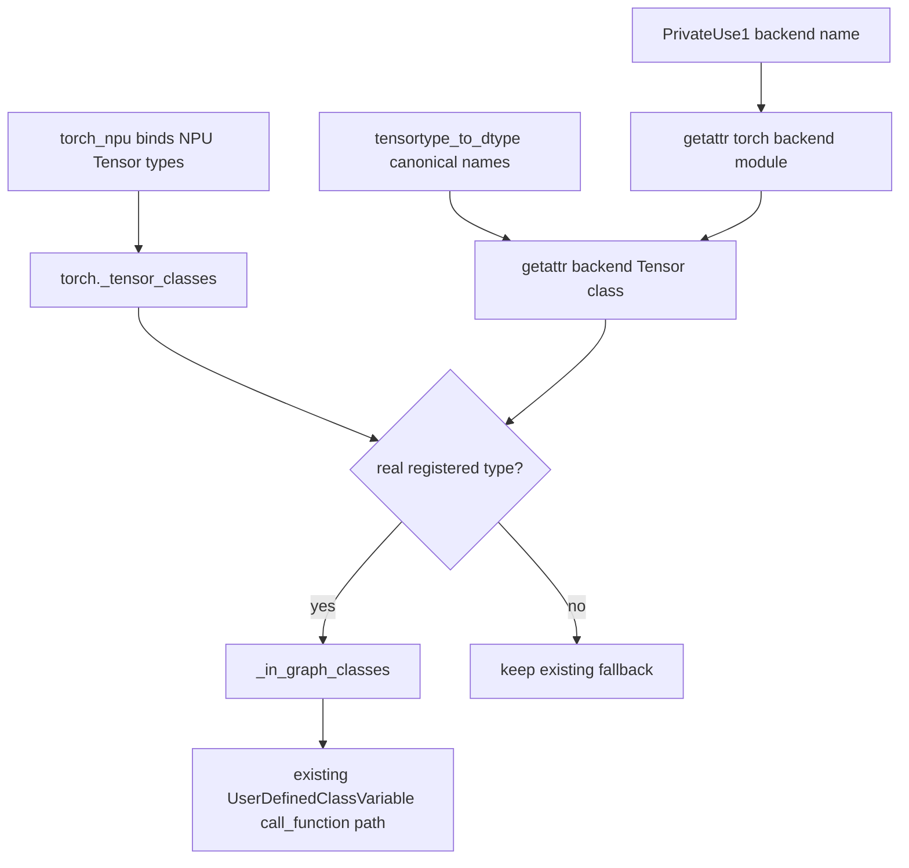

# torch_npu Monkey Patch 消除评审报告（4/4：NPU Tensor 类型）

> 依据 [`patch消除评审模板.md`](patch消除评审模板.md) 填写。本报告只评审
> `patch_user_defined_class_variable` 中十种 NPU Tensor 类型的 `__new__` 拦截。
> `patch_TensorVariable_call_method` 处理 Tensor 实例 `.type()` 的运行时语义，仍在任务范围外。

---

## 基本信息

| 项目 | 内容 |
|------|------|
| Patch 名称 | `patch_user_defined_class_variable` — NPU Tensor 类型子修改 |
| 原始提交人 | 源码中未发现明确证据，待从原始 PR/Blame 补充 |
| 消除提交人 | 待提交时填写 |
| 提交日期 | 待提交时填写，不以运行环境日期代填 |
| 目标分支 | PyTorch detached HEAD `0c4461ed5d95`；torch_npu detached HEAD `741ee42ce188`，实际提交分支待填 |
| 相关 Issue | 源码和现有交付文档中未发现明确证据，待填 |
| 原始 PR | 源码中未发现明确证据，待填 |

---

## 1. Patch 消除概述

### 1.1 Patch 原始背景

torch_npu 暴露 `BoolTensor`、`ByteTensor`、`CharTensor`、`DoubleTensor`、
`FloatTensor`、`HalfTensor`、`IntTensor`、`LongTensor`、`ShortTensor` 和
`BFloat16Tensor` 十种传统 Tensor 构造类型。

原 patch 的目的不是改变算子或 Tensor 运行时语义，而是修正 Dynamo 对“Tensor 类对象调用”的
选路。未 patch 时，这些 PrivateUse1 Tensor 类会作为普通
`UserDefinedClassVariable` 处理，但没有被列入其既有图内构造集合；继续追踪 C 扩展类型构造过程会
失败。原 patch 因此全局替换 `UserDefinedClassVariable.__new__`，把十个精确对象改造成
`TorchInGraphFunctionVariable`。

本节只保留说明“已登记、未进图、Patch 强制改道”的最小片段，完整代码见
1.2、1.3 和 2.2。

代码框文件：`pytorch/torch/__init__.py`（upstream HEAD `0c4461ed5d95`，
PyTorch 已有 Tensor 类型登记集合）

```python
_tensor_classes: set[type["torch.Tensor"]] = set()
```

代码框文件：`torch_npu/torch_npu/csrc/utils/TensorType.cpp`（torch_npu 基线
`741ee42ce188`，NPU 类型绑定与登记的关键语句）

```cpp
PyModule_AddObject(module_obj.get(), type_name.c_str(), type_obj);
PySet_Add(tensor_classes.get(), type_obj);
```

这段代码证明 NPU 类型已经作为真实 Python type 挂到对应 module，并进入
`torch._tensor_classes`，无需再增加后端私有元数据。

代码框文件：`pytorch/torch/_dynamo/variables/user_defined.py`（upstream HEAD
`0c4461ed5d95`，原集合中的 Tensor 类成员摘录）

```python
torch.Tensor,
torch.cuda.FloatTensor,
torch.cuda.DoubleTensor,
# ... 其他 CUDA legacy Tensor 类

return set(tensortype_to_dtype.keys()) | _in_graph_class_list
```

原始集合包含 PyTorch 自己的 legacy Tensor 类型，但没有从当前 PrivateUse1 module 读取
已经登记到 `torch._tensor_classes` 的 NPU 类型。

代码框文件：`torch_npu/torch_npu/utils/_dynamo.py`（torch_npu 基线
`741ee42ce188`，原 Patch 的 Tensor 对象拦截摘录，中间同类成员省略）

```python
elif value in [
    torch_npu.npu.BoolTensor,
    torch_npu.npu.ByteTensor,
    # ... 其他 NPU legacy Tensor 类
    torch_npu.npu.BFloat16Tensor,
]:
    return TorchInGraphFunctionVariable(value, **kwargs)
```

代码框文件：`pytorch/torch/_dynamo/variables/user_defined.py`（upstream HEAD
`0c4461ed5d95`，现有图内类调用门禁与通用 FX 节点分支）

```python
elif (
    self.value in self._in_graph_classes()
    or is_traceable_wrapper_subclass_type(self.value)
):
```

一旦命中集合，Tensor 类会复用现有的通用 FX 节点分支：

代码框文件：`pytorch/torch/_dynamo/variables/user_defined.py`（upstream HEAD
`0c4461ed5d95`，通用 FX 节点关键片段）

```python
else:
    tensor_variable = wrap_fx_proxy(
        tx=tx,
        proxy=tx.output.create_proxy("call_function", self.value, ...),
    )

return tensor_variable
```

前一个代码段证明集合成员才能进入该路由；后一个代码段证明 Tensor 类型命中后可直接复用
现有 `UserDefinedClassVariable.call_function()` 创建 FX 节点，不需要转换成
`TorchInGraphFunctionVariable`。

### 1.2 Patch 对应的社区代码

本节所有 `pytorch/` 代码均取自未应用候选修改的 upstream HEAD `0c4461ed5d95`；
`torch_npu/` C++ 代码仅用于说明既有类型注册事实，候选修改后源码只在 2.2 展示。

| 社区/后端代码 | 职责 |
| --- | --- |
| `pytorch/torch/_dynamo/variables/user_defined.py::UserDefinedClassVariable._in_graph_classes` | 集中维护允许按图内 call 构造的 Tensor/Stream/Event 类 |
| `pytorch/torch/_dynamo/variables/user_defined.py::UserDefinedClassVariable.call_function` | 对集合成员创建现有 `call_function` FX proxy |
| `pytorch/torch/_dynamo/utils.py::tensortype_to_dtype` | PyTorch 已有 legacy Tensor 类型及其 canonical 名称来源 |
| `torch_npu/torch_npu/csrc/utils/TensorType.cpp::py_bind_tensor_types` | 将 NPU Tensor 类型绑定到 module 并加入 `torch._tensor_classes` |

典型场景：

代码框文件：评审用例（非仓库源码）

```python
@torch.compile(backend="eager", fullgraph=True)
def fn(values):
    return torch_npu.npu.FloatTensor(values)
```

代码框文件：`pytorch/torch/__init__.py`（upstream HEAD）

类型集合定义源码：

```python
_tensor_classes: set[type["torch.Tensor"]] = set()
```

代码框文件：`torch_npu/torch_npu/csrc/utils/TensorType.cpp`（torch_npu 基线）

`py_bind_tensor_types()` 完整源码：

```cpp
static void py_bind_tensor_types(
    const std::vector<PyTensorType>& tensor_types) {
  auto torch_module = THPObjectPtr(PyImport_ImportModule("torch"));
  if (!torch_module) {
    throw python_error();
  }

  auto tensor_classes = THPObjectPtr(
      PyObject_GetAttrString(torch_module.get(), "_tensor_classes"));
  if (!tensor_classes) {
    throw python_error();
  }

  for (auto& tensor_type : tensor_types) {
    auto name = std::string(tensor_type.name);
    auto idx = name.rfind('.');
    auto type_name = name.substr(idx + 1);
    auto module_name = name.substr(0, idx);

    auto module_obj = THPObjectPtr(PyImport_ImportModule(module_name.c_str()));
    if (!module_obj) {
      throw python_error();
    }

    PyObject* type_obj = (PyObject*)&tensor_type;
    Py_INCREF(type_obj);
    if (PyModule_AddObject(module_obj.get(), type_name.c_str(), type_obj) < 0) {
      throw python_error();
    }
    if (PySet_Add(tensor_classes.get(), type_obj) < 0) {
      throw python_error();
    }
  }
}
```

代码框文件：`pytorch/torch/_dynamo/variables/builder.py`（upstream HEAD）

`VariableBuilder._wrap` 中类对象回退的完整逻辑块：

```python
result = UserDefinedClassVariable(
    value,
    source=self.source,
)

mod = getattr(value, "__module__", None) or ""
if mod != "torch" and not mod.startswith(("torch.", "torch_")):
    if value not in self.tx.output.side_effects:
        return self.tx.output.side_effects.track_object_existing(
            value, result
        )
return result
```

代码框文件：`pytorch/torch/_dynamo/variables/user_defined.py`（upstream HEAD）

`UserDefinedClassVariable._in_graph_classes()` 原始完整源码：

```python
@staticmethod
@functools.cache
def _in_graph_classes() -> set[type[object]]:
    _in_graph_class_list = {
        torch.Tensor,
        torch.cuda.FloatTensor,  # type: ignore[attr-defined]
        torch.cuda.DoubleTensor,  # type: ignore[attr-defined]
        torch.cuda.HalfTensor,  # type: ignore[attr-defined]
        torch.cuda.BFloat16Tensor,  # type: ignore[attr-defined]
        torch.cuda.ByteTensor,  # type: ignore[attr-defined]
        torch.cuda.CharTensor,  # type: ignore[attr-defined]
        torch.cuda.IntTensor,  # type: ignore[attr-defined]
        torch.cuda.ShortTensor,  # type: ignore[attr-defined]
        torch.cuda.LongTensor,  # type: ignore[attr-defined]
        torch.Stream,
        torch.Event,
        torch.cuda.Stream,
        torch.cuda.Event,
        torch.xpu.Stream,
        torch.xpu.Event,
    }
    if hasattr(torch, "hpu"):
        _in_graph_class_list.update(
            {
                torch.hpu.Stream,
                torch.hpu.Event,
            }
        )

    return set(tensortype_to_dtype.keys()) | _in_graph_class_list
```

代码框文件：`pytorch/torch/_dynamo/variables/user_defined.py`（upstream HEAD）

`UserDefinedClassVariable.call_function()` 中从外层 `elif` 到 `return` 的完整图内类分支：

```python
elif (
    self.value in self._in_graph_classes()
    or is_traceable_wrapper_subclass_type(self.value)
):
    # torch.LongTensor cannot accept a list of FakeTensors.
    # So we stack the list of FakeTensors instead.
    from .lists import ListVariable

    if (
        np
        and self.value in tensortype_to_dtype
        and len(args) == 1
        and isinstance(args[0], ListVariable)
        and len(args[0].items) > 1
        and all(x.is_tensor() for x in args[0].items)
    ):
        # Stack FakeTensor
        stacked = wrap_fx_proxy(
            tx=tx,
            proxy=tx.output.create_proxy(
                "call_function",
                torch.stack,
                *proxy_args_kwargs(args, kwargs),
            ),
        )
        args = [stacked]

    if issubclass(self.value, torch.Stream):
        from .lists import TupleVariable

        var_kwargs = ConstDictVariable(
            {VariableTracker.build(tx, k): v for k, v in kwargs.items()}
        )
        var_args = TupleVariable(list(args))
        stream = self.value(
            *(var_args.as_python_constant()),
            **(var_kwargs.as_python_constant()),
        )
        from ..graph_bytecode_inputs import register_graph_created_object
        from .streams import StreamVariable

        ind = register_graph_created_object(
            stream,
            StreamVariable.make_construct_in_graph_stream_fn(
                var_args, var_kwargs
            ),
        )
        tensor_variable = wrap_fx_proxy(
            tx=tx,
            proxy=tx.output.create_proxy(
                "call_function", get_external_object_by_index, (ind,), {}
            ),
        )
    elif issubclass(self.value, torch.Event):
        from .lists import TupleVariable

        # Register newly created event for reconstruction
        var_kwargs = ConstDictVariable(
            {VariableTracker.build(tx, k): v for k, v in kwargs.items()}
        )
        var_args = TupleVariable(list(args))
        event = self.value(
            *(var_args.as_python_constant()),
            **(var_kwargs.as_python_constant()),
        )
        from ..graph_bytecode_inputs import register_graph_created_object
        from .streams import EventVariable

        ind = register_graph_created_object(
            event,
            EventVariable.make_construct_in_graph_event_fn(
                var_args, var_kwargs
            ),
        )
        tensor_variable = wrap_fx_proxy(
            tx=tx,
            proxy=tx.output.create_proxy(
                "call_function", get_external_object_by_index, (ind,), {}
            ),
        )
    else:
        tensor_variable = wrap_fx_proxy(
            tx=tx,
            proxy=tx.output.create_proxy(
                "call_function",
                self.value,
                *proxy_args_kwargs(args, kwargs),
            ),
        )

    return tensor_variable
```

### 1.3 Patch 代码描述

修改前 `torch_npu/torch_npu/utils/_dynamo.py::patch_user_defined_class_variable`
完整源码如下；本报告关注十种 Tensor 类型分支，其余部分由报告 2、3 评审：

代码框文件：`torch_npu/torch_npu/utils/_dynamo.py`（torch_npu 基线、原 Patch）

```python
def patch_user_defined_class_variable():
    import functools
    from torch._dynamo.variables.user_defined import UserDefinedClassVariable
    from torch._dynamo.variables.torch import TorchCtxManagerClassVariable
    from torch._dynamo.variables.torch import TorchInGraphFunctionVariable
    original_method = UserDefinedClassVariable._in_graph_classes

    class NPUTorchCtxManagerClassVariable(TorchCtxManagerClassVariable):
        def call_function(self, tx, args, kwargs):
            return _create_npu_autocast_mode_variable(self.value, args, kwargs)

    @staticmethod
    @functools.lru_cache(None)
    def patched_in_graph_classes():
        result = original_method()
        result.add(torch.npu.Event)
        result.add(torch.npu.Stream)
        return result

    def UserDefinedClassVariable__new__(cls, value, **kwargs):
        if value in [
            torch.npu.amp.autocast,
            torch_npu.npu.amp.autocast,
            torch.npu.amp.autocast_mode.autocast,
            torch_npu.npu.amp.autocast_mode.autocast,
        ]:
            return NPUTorchCtxManagerClassVariable(value, **kwargs)
        elif value in [
            torch_npu.npu.BoolTensor,
            torch_npu.npu.ByteTensor,
            torch_npu.npu.CharTensor,
            torch_npu.npu.DoubleTensor,
            torch_npu.npu.FloatTensor,
            torch_npu.npu.HalfTensor,
            torch_npu.npu.IntTensor,
            torch_npu.npu.LongTensor,
            torch_npu.npu.ShortTensor,
            torch_npu.npu.BFloat16Tensor,
        ]:
            return TorchInGraphFunctionVariable(value, **kwargs)
        return cls.__new__raw(cls)

    UserDefinedClassVariable._in_graph_classes = patched_in_graph_classes
    UserDefinedClassVariable.__new__raw = UserDefinedClassVariable.__new__
    UserDefinedClassVariable.__new__ = UserDefinedClassVariable__new__
```

修改前安装入口完整源码：

代码框文件：`torch_npu/torch_npu/utils/_dynamo.py`（torch_npu 基线、原 Patch）

```python
@run_once
def add_dynamo_methods_init():
    _dynamo_register_interface_for_device()
    patch_SkipFunctionVariable()
    patch_TensorVariable_call_method()
    patch_user_defined_class_variable()
    patch_stream_event_variable_python_type()
    patch_npu_stream_context()
```

对象白名单边界是合理的，但用 `__new__` monkey patch 建立路由会修改所有
`UserDefinedClassVariable` 的全局构造入口，且需要 torch_npu 长期追随上游内部实现。

---

## 2. 消除方案

### 2.1 消除方式

- [ ] **直接删除** - 移除全部 Patch 代码，无需替换
- [x] **替换为社区标准方式** - 扩展现有 `_in_graph_classes()` 硬编码路由
- [ ] **降级为条件 Patch** - 保留 Patch 但增加版本条件判断
- [ ] **其他**

不新增 `DeviceInterface` 槽位、不增加 `NpuInterface` 私有元数据、不修改 Builder，
也不新增 Tensor trace rule。PyTorch 在现有 `_in_graph_classes()` 中根据 PrivateUse1
后端名取得 module，再按现有 Tensor canonical 名称逐个 `getattr`。

### 2.2 总体方案

#### 文件一：`pytorch/torch/_dynamo/variables/user_defined.py`

候选工作树中的完整 `_in_graph_classes()` 如下。该函数同时包含报告 2 的注册
DeviceInterface Stream/Event 收集逻辑；本报告负责的 Tensor 逻辑位于中段，通过后端 module
发现并验证 PrivateUse1 Tensor 类型。

代码框文件：`pytorch/torch/_dynamo/variables/user_defined.py`（候选工作树，完整函数）

```python
@staticmethod
@functools.cache
def _in_graph_classes() -> set[type[object]]:
    _in_graph_class_list = {
        torch.Tensor,
        torch.cuda.FloatTensor,  # type: ignore[attr-defined]
        torch.cuda.DoubleTensor,  # type: ignore[attr-defined]
        torch.cuda.HalfTensor,  # type: ignore[attr-defined]
        torch.cuda.BFloat16Tensor,  # type: ignore[attr-defined]
        torch.cuda.ByteTensor,  # type: ignore[attr-defined]
        torch.cuda.CharTensor,  # type: ignore[attr-defined]
        torch.cuda.IntTensor,  # type: ignore[attr-defined]
        torch.cuda.ShortTensor,  # type: ignore[attr-defined]
        torch.cuda.LongTensor,  # type: ignore[attr-defined]
        torch.Stream,
        torch.Event,
        torch.cuda.Stream,
        torch.cuda.Event,
        torch.xpu.Stream,
        torch.xpu.Event,
    }
    if hasattr(torch, "hpu"):
        _in_graph_class_list.update(
            {
                torch.hpu.Stream,
                torch.hpu.Event,
            }
        )

    privateuse1_module = getattr(
        torch, torch._C._get_privateuse1_backend_name(), None
    )
    if privateuse1_module is not None:
        for tensor_type in tensortype_to_dtype:
            privateuse1_tensor_type = getattr(
                privateuse1_module, tensor_type.__name__, None
            )
            if (
                isinstance(privateuse1_tensor_type, type)
                and privateuse1_tensor_type in torch._tensor_classes
            ):
                _in_graph_class_list.add(privateuse1_tensor_type)

    for _, device_interface in get_registered_device_interfaces():
        stream_class = getattr(device_interface, "Stream", ())
        if isinstance(stream_class, type) and issubclass(
            stream_class, torch.Stream
        ):
            _in_graph_class_list.add(stream_class)

        event_class = getattr(device_interface, "Event", ())
        if isinstance(event_class, type) and issubclass(event_class, torch.Event):
            _in_graph_class_list.add(event_class)

    return set(tensortype_to_dtype.keys()) | _in_graph_class_list
```

`call_function()` 则继续复用 1.2 展示的完整 upstream 分支：集合命中后进入普通
`call_function` FX proxy 路由。本文件中属于 Tensor 子任务的完整关键 diff 为：

本文件的完整关键 diff：

代码框文件：`pytorch/torch/_dynamo/variables/user_defined.py`（upstream HEAD → 候选工作树）

```diff
 @staticmethod
 @functools.cache
 def _in_graph_classes() -> set[type[object]]:
     _in_graph_class_list = {
         torch.Tensor,
         torch.cuda.FloatTensor,
         torch.cuda.DoubleTensor,
         torch.cuda.HalfTensor,
         torch.cuda.BFloat16Tensor,
         torch.cuda.ByteTensor,
         torch.cuda.CharTensor,
         torch.cuda.IntTensor,
         torch.cuda.ShortTensor,
         torch.cuda.LongTensor,
         torch.Stream,
         torch.Event,
         torch.cuda.Stream,
         torch.cuda.Event,
         torch.xpu.Stream,
         torch.xpu.Event,
     }
     if hasattr(torch, "hpu"):
         _in_graph_class_list.update(
             {
                 torch.hpu.Stream,
                 torch.hpu.Event,
             }
         )
+
+    privateuse1_module = getattr(
+        torch, torch._C._get_privateuse1_backend_name(), None
+    )
+    if privateuse1_module is not None:
+        for tensor_type in tensortype_to_dtype:
+            privateuse1_tensor_type = getattr(
+                privateuse1_module, tensor_type.__name__, None
+            )
+            if (
+                isinstance(privateuse1_tensor_type, type)
+                and privateuse1_tensor_type in torch._tensor_classes
+            ):
+                _in_graph_class_list.add(privateuse1_tensor_type)

     return set(tensortype_to_dtype.keys()) | _in_graph_class_list
```

说明：上面的候选源码框展示合并后的完整函数；diff 框只突出本报告所属的 Tensor 新增逻辑，
没有用省略号代替该逻辑。

这里的两个边界分别是：

- `tensortype_to_dtype` 只复用 PyTorch 已有十种 legacy Tensor 的名称，不引入 NPU 名称表。
- `torch._tensor_classes` 只接受后端真实登记的 Tensor 类型；module 上未登记的同名属性不会命中。

#### 文件二：`torch_npu/torch_npu/csrc/utils/TensorType.cpp`

该文件无需修改；总体方案直接复用 1.2 展示的完整 `py_bind_tensor_types()`。其中登记核心为：

代码框文件：`torch_npu/torch_npu/csrc/utils/TensorType.cpp`（torch_npu 基线，保持不变）

```cpp
auto tensor_classes = THPObjectPtr(
    PyObject_GetAttrString(torch_module.get(), "_tensor_classes"));
if (PySet_Add(tensor_classes.get(), type_obj) < 0) {
  throw python_error();
}
```

本文件无关键 diff：无需为 Dynamo 增加 C++ 元数据或新注册接口。

#### 文件三：`pytorch/torch/_dynamo/device_interface.py`

Tensor 类型由 C++ 先登记，NPU 的 `DeviceInterface` 随后注册；注册动作清理集合缓存，保证
`_in_graph_classes()` 首次构建前后两种顺序都能重新发现类型：

代码框文件：`pytorch/torch/_dynamo/device_interface.py`（候选工作树）

```python
def register_interface_for_device(
    device: str | torch.device, device_interface: type[DeviceInterface]
) -> None:
    if isinstance(device, torch.device):
        device = device.type
    device_interfaces[device] = device_interface
    from .variables.user_defined import UserDefinedClassVariable

    UserDefinedClassVariable._in_graph_classes.cache_clear()
```

本文件的完整关键 diff：

代码框文件：`pytorch/torch/_dynamo/device_interface.py`（upstream HEAD → 候选工作树）

```diff
 def register_interface_for_device(
     device: str | torch.device, device_interface: type[DeviceInterface]
 ) -> None:
     if isinstance(device, torch.device):
         device = device.type
     device_interfaces[device] = device_interface
+    from .variables.user_defined import UserDefinedClassVariable
+
+    UserDefinedClassVariable._in_graph_classes.cache_clear()
```

#### 文件四：`torch_npu/utils/_dynamo.py`

torch_npu 不再为十种 Tensor 类型追加类规则，而是直接删除原 `__new__` 分支和 patch 安装调用。

代码框文件：`torch_npu/torch_npu/utils/_dynamo.py`（torch_npu 基线 → 候选工作树，Tensor 分支）

```diff
-    def UserDefinedClassVariable__new__(cls, value, **kwargs):
-        if value in [
-            torch_npu.npu.BoolTensor,
-            torch_npu.npu.ByteTensor,
-            torch_npu.npu.CharTensor,
-            torch_npu.npu.DoubleTensor,
-            torch_npu.npu.FloatTensor,
-            torch_npu.npu.HalfTensor,
-            torch_npu.npu.IntTensor,
-            torch_npu.npu.LongTensor,
-            torch_npu.npu.ShortTensor,
-            torch_npu.npu.BFloat16Tensor,
-        ]:
-            return TorchInGraphFunctionVariable(value, **kwargs)
-        return cls.__new__raw(cls)
```

代码框文件：`torch_npu/torch_npu/utils/_dynamo.py`（torch_npu 基线 → 候选工作树，安装入口）

```diff
 def add_dynamo_methods_init():
     _dynamo_register_interface_for_device()
     patch_TensorVariable_call_method()
-    patch_user_defined_class_variable()
     patch_stream_event_variable_python_type()
     patch_npu_stream_context()
```

消除 patch 后的完整初始化函数：

代码框文件：`torch_npu/torch_npu/utils/_dynamo.py`（候选工作树）

```python
@run_once
def add_dynamo_methods_init():
    _dynamo_register_interface_for_device()
    patch_TensorVariable_call_method()
    patch_stream_event_variable_python_type()
    patch_npu_stream_context()
```

`torch_npu/dynamo/trace_rule.py` 不增加 `npu_tensor_type_classes`，PyTorch 的
`trace_rules.py` 和 `variables/builder.py` 也保持无 diff。

#### 有 patch 时的路由（含源码）

Builder 先按社区默认路径构造 `UserDefinedClassVariable`：

代码框文件：`pytorch/torch/_dynamo/variables/builder.py`（upstream HEAD）

```python
result = UserDefinedClassVariable(
    value,
    source=self.source,
)
return result
```

由于构造函数已被 patch，十种对象被改造成 `TorchInGraphFunctionVariable`：

代码框文件：`torch_npu/torch_npu/utils/_dynamo.py`（torch_npu 基线、原 Patch）

```python
def UserDefinedClassVariable__new__(cls, value, **kwargs):
    if value in [
        torch_npu.npu.BoolTensor,
        torch_npu.npu.ByteTensor,
        torch_npu.npu.CharTensor,
        torch_npu.npu.DoubleTensor,
        torch_npu.npu.FloatTensor,
        torch_npu.npu.HalfTensor,
        torch_npu.npu.IntTensor,
        torch_npu.npu.LongTensor,
        torch_npu.npu.ShortTensor,
        torch_npu.npu.BFloat16Tensor,
    ]:
        return TorchInGraphFunctionVariable(value, **kwargs)
    return cls.__new__raw(cls)
```

`TorchInGraphFunctionVariable.call_function()` 最终创建普通 FX call：

代码框文件：`pytorch/torch/_dynamo/variables/torch.py`（upstream HEAD）

```python
fn_ = self.value
tensor_variable = wrap_fx_proxy(
    tx=tx,
    proxy=tx.output.create_proxy(
        "call_function",
        fn_,
        *proxy_args_kwargs(args, kwargs),
    ),
)
```

代码框类型：路由示意（非仓库源码）

```text
LOAD NPU Tensor 类 → UserDefinedClassVariable.__new__ patch
→ TorchInGraphFunctionVariable → call_function FX node → TensorVariable
```

#### 消除 patch 后的路由（含源码）

类对象仍由社区 Builder 正常包装：

代码框文件：`pytorch/torch/_dynamo/variables/builder.py`（upstream HEAD，候选方案保持不变）

```python
result = UserDefinedClassVariable(
    value,
    source=self.source,
)
return result
```

调用时先命中 1.2 完整展示的 `_in_graph_classes()` 分支。NPU Tensor 不是
Stream/Event，因此执行该完整分支中的以下最终源码：

代码框文件：`pytorch/torch/_dynamo/variables/user_defined.py`（候选工作树）

```python
else:
    tensor_variable = wrap_fx_proxy(
        tx=tx,
        proxy=tx.output.create_proxy(
            "call_function",
            self.value,
            *proxy_args_kwargs(args, kwargs),
        ),
    )

return tensor_variable
```

完整可执行分支已在 1.2 展示；这里保留路由判定和最终 FX 节点，以明确中间
VariableTracker 不再是 `TorchInGraphFunctionVariable`。

代码框类型：路由示意（非仓库源码）

```text
LOAD NPU Tensor 类 → UserDefinedClassVariable
→ _in_graph_classes 的 PrivateUse1 getattr + torch._tensor_classes 校验
→ UserDefinedClassVariable.call_function 普通 FX 分支 → TensorVariable
```

#### 完整调用链

1. torch_npu 初始化 NPU Tensor 类型，把类型对象挂到 `torch.npu`/`torch_npu.npu`，并加入
   `torch._tensor_classes`。
2. `UserDefinedClassVariable._in_graph_classes()` 取得当前 PrivateUse1 后端名，例如 `npu`。
3. `getattr(torch, "npu", None)` 取得 module；循环复用 `tensortype_to_dtype` 中现有类型名。
4. `getattr(torch.npu, "FloatTensor", None)` 取得候选对象。
5. 只有候选是 type 且属于 `torch._tensor_classes` 才加入集合。
6. `UserDefinedClassVariable.call_function()` 命中既有集合分支，创建 `call_function` FX proxy。
7. 若 NPU 接口在集合首次构建后注册，`register_interface_for_device()` 清理缓存，下一次查询会同时
   重建 Tensor 与 Stream/Event 集合。

代码框类型：调用链示意（非仓库源码）



#### 影响范围与限制

- 不增加任何 DeviceInterface/NpuInterface Tensor 元数据。
- 不改变 `trace_rules`、`VariableBuilder` 或 `SourcelessBuilder`。
- 不用 `torch_npu` 名称、import 或类型继承关系识别后端。
- 其他 PrivateUse1 后端只有在同时暴露 canonical 名称并把真实 type 登记到
  `torch._tensor_classes` 时才进入已有路由。
- 传统 dtype Tensor 构造器已有不推荐警告；本变更只保持已有 Dynamo 兼容性。
- `patch_TensorVariable_call_method` 仍保留，与本报告的类对象构造路由无关。

### 2.3 技术选型（可选）

| 方案 | 优点 | 缺点 | 结论 |
| --- | --- | --- | --- |
| 保留 `UserDefinedClassVariable.__new__` patch | 当前行为可用 | 全局劫持、跟随上游内部实现 | 不选 |
| `DeviceInterface.tensor_types` | 显式扩展点 | 新增公共槽位并影响其他 PU 合约 | 不选 |
| `NpuInterface._dynamo_tensor_types` | PyTorch 可 `getattr` | 引入后端私有元数据 | 不选 |
| 新增 `lookup_class`/Builder/trace rule | 可精确登记 | 新路由面和维护表过多 | 不选 |
| `_in_graph_classes()` 中 PrivateUse1 `getattr` | 复用已有硬编码控制点和现有构造语义 | 仅覆盖 canonical legacy Tensor 名称 | **采用** |

---

## 附录：PR 提交功能验证参考

### A.1 测试覆盖

| 测试类型 | 是否执行 | 测试结果 | 说明 |
|----------|---------|---------|------|
| 单元测试 | ☑ 是 ☐ 否 | ☑ 通过 ☐ 未通过 | 新增路由单测 1 passed；覆盖已登记命中和未登记隔离 |
| 集成测试 | ☑ 是 ☐ 否 | ☑ 通过 ☐ 未通过 | 真实 NPU smoke：10/10 类型进入集合，晚注册缓存刷新通过 |
| 回归测试 | ☑ 是 ☐ 否 | ☐ 通过 ☑ 未通过 | baseline/candidate 均 20 pass / 1 error；ERROR 不计 PASS |
| 精度对比测试 | ☐ 是 ☑ 否 | ☐ 通过 ☑ 未通过 | 本变更只改 Dynamo 类路由，未执行精度对比 |
| 性能对比测试 | ☐ 是 ☑ 否 | ☐ 通过 ☑ 未通过 | 未执行 |

### A.2 测试环境

| 项目 | 内容 |
|------|------|
| PyTorch 版本 | `2.14.0.dev20260805+cpu` (`f012e05e1018`) |
| torch_npu 版本 | `2.14.0+git06101a0` (`06101a0ec0be`) |
| CANN 版本 | `9.0.0`，来自 `/usr/local/Ascend/ascend-toolkit/latest/compiler/version.info` |
| 硬件型号 | 当前环境未取得可引用的型号证据 |

### A.3 测试结果说明

所有测试从 `/home/z50063656/tmp` 启动。

- 聚焦 PyTorch 单测：`test_privateuse1_tensor_types_in_graph_classes`，1 passed。
- 真实 NPU smoke：十种类型均已在 `torch._tensor_classes`，均进入
  `_in_graph_classes()`；先预热缓存再注册 NPU 接口后仍通过。
- fresh baseline → candidate 对照各运行 21 项，两态均 20 pass / 1 error。
- 唯一 ERROR identity 均为
  `TestTensorTypes.test_all_tensor_types_construct`，最终签名均为
  `FailOnRecompileLimitHit: Hard failure due to fullgraph=True`，不是候选新增失败，且不计为 PASS。
- 日志：`/home/z50063656/tmp/dynamo-privateuse1-tensor-getattr-{baseline,candidate}.log`。
- 哈希：同名前缀 `.sha256`；归一化失败签名：同名前缀 `.signatures`，两态无 diff。
